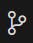
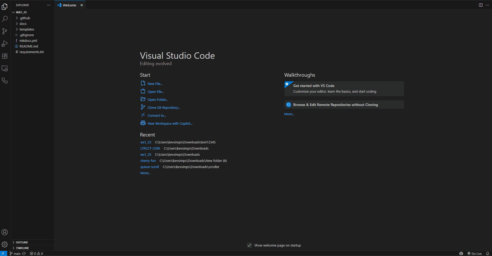

# Initial Setup

> This lab guide template uses MKDocs to take your markdown documentation and transform it into an interactive web based lab guide.  You will need to install some software on your PC or Mac in order to take full advantage of the tool which will allow you to view your changes as you save them and ensure that your formatting is exactly how you want it.

## Prerequisite Software to Install
1. Python
2. Visual Studio Code
3. Git

---

## Setting up your lab guide on your computer

### Clone your repository with git
> Open Visual Studio Code
>
> Click the Source Control button in the left menu 
>
> Click Clone Repository
>
> Enter the repository source: <copy> {{config.extra.repo}}</copy>
>
> Select or create a new folder to clone the repository into.
>
> 

### Build the environment

> When prompted to open the cloned repository, select open.
>
> Drag open the terminal at the bottom of the Visual Studio Code window
> 
> ??? Note "Show Me"
    

> === "If you are on a PC"
> 
    > In your terminal enter the following commands:
    >
    > <copy>python -m venv venv</copy>
    >
    > <copy>Set-ExecutionPolicy -ExecutionPolicy RemoteSigned -Scope CurrentUser</copy>
    >
    > <copy>venv\Scripts\activate.ps1</copy>
    > 
    > <copy>pip install -r requirements.txt</copy>
    >
    > <copy>mkdocs serve</copy>
    >
    > Open a browser to [http://127.0.0.1:8000](http://127.0.0.1:8000){:target="_blank"}
    >

> === "If you are on a Mac"
> 
    > In your terminal enter the following commands:
    >
    > <copy>python -m venv venv</copy>
    >
    > <copy>source venv/bin/activate</copy>
    >     
    > <copy>pip install -r requirements.txt</copy>
    >
    > <copy>mkdocs serve</copy>
    >
    > Open a browser to [http://127.0.0.1:8000](http://127.0.0.1:8000){:target="_blank"}

---
