# Lab 1 - Proactive Outbound Reach 📞

## Lab Purpose

In this lab, you will configure the **Webex Contact Center (WxCC) Campaign Manager** to initiate proactive outbound calls to customers with an upcoming debt maturity. This lab sets the foundation for the full debt collection use case that continues in Lab 2, where an AI Agent will handle the conversations triggered by the outbound campaign.

**Webex Campaign Management** is an add-on module for the **Webex Contact Center** platform, providing administrators and supervisors the ability to configure, manage, and optimize outbound communication campaigns. This module is accessed through the **Webex Control Hub**, a unified administration console that centralizes management of all Webex Contact Center services.

The module supports the deployment of agent-assisted outbound campaigns using multiple dialing modes such as preview, progressive, and predictive to maximize agent efficiency and contact rates. Additionally, it facilitates the execution of agentless IVR campaigns, enabling automated outbound interactions without live agent involvement.

Lab Objectives

* **Control Hub Configuration:** Configure agents, teams, queues, and global variables in Webex Control Hub.
* **Flow Builder:** Create a dummy validation flow and the outbound campaign flow with the required event handling.
* **Campaign Manager:** Configure all pre-requisites (contact modes, field mappings, suppression rules, meta-tags, etc.) and create and activate an outbound campaign.
* **End-to-End Validation:** Successfully receive a test call confirming the lab completion.

Lab Outcome

By the end of Lab 1, you will have a fully operational outbound campaign infrastructure in place. The campaign will be capable of:

1. **Dialling contacts** from an uploaded contact list using a Progressive IVR campaign mode.
2. **Routing answered calls** through a WxCC flow that passes customer data to a destination flow.
3. **Handling call outcomes** (AMD, Abandoned, Live Voice) using event-driven flow logic.
4. **Delivering a test message** confirming that the full outbound path is working end to end.

???+ warning
    This lab must be completed before starting Lab 2. The outbound campaign infrastructure configured here is required by the AI Agent integration in Lab 2.

---

## Lab Overview 📌

A high-level overview of the different modules associated with Control Hub within Webex Contact Center:

[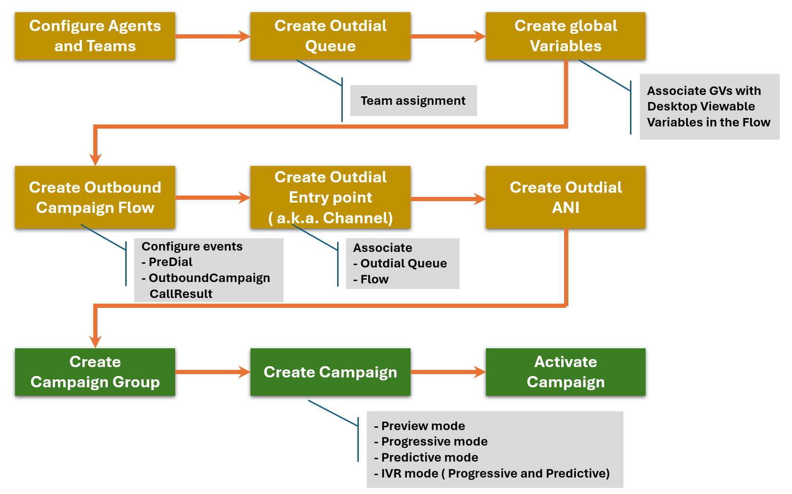](assets/image1.png)

In this lab you will perform the following tasks:

1. Configure Agents, Teams, Queues and Global Variables in Control Hub
2. Create a dummy validation flow
3. Create the Outbound Campaign Flow
4. Create the Entry Point (Channel) and Outdial ANI
5. Configure Business Hours in Control Hub
6. Configure Campaign Manager pre-requisites
7. Create and Activate the Campaign
8. Upload the Contact List and test the end-to-end scenario

---

## Lab 1.1 - Configure Agents and Teams in Control Hub

In this section you will configure the basic WxCC resources required for the outbound campaign: user, team, out-dial queue, and global variables.

### Create User and Assign Contact Center Licence

1. Navigate to [Control Hub](https://admin.webex.com) and go to **Users**.
2. Create the user and assign the **Contact Center licence** (standard or premium).

[](assets/image2.png)

[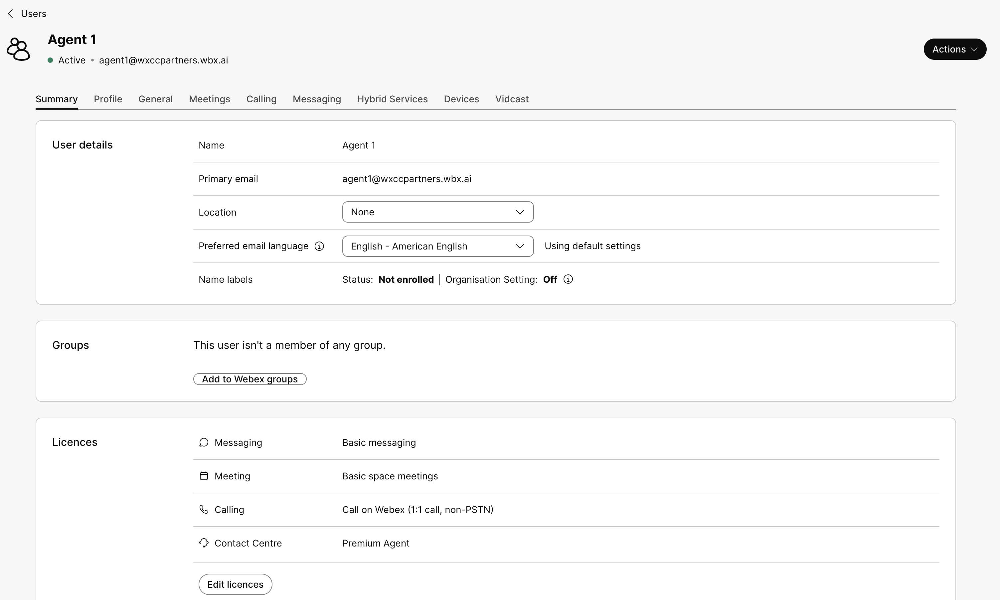](assets/image3.png)

### Create Team

1. In Control Hub, navigate to **Contact Center** > **Teams**.
2. Click **Create Team** and fill in the required details.

[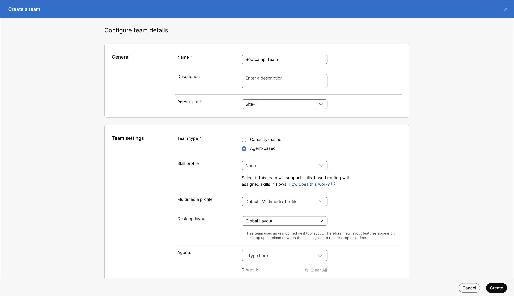](assets/image4.png)

### Enable Contact Center for the User

1. Navigate to the user's profile and enable **Contact Center**.
2. Configure the agent settings as required.

[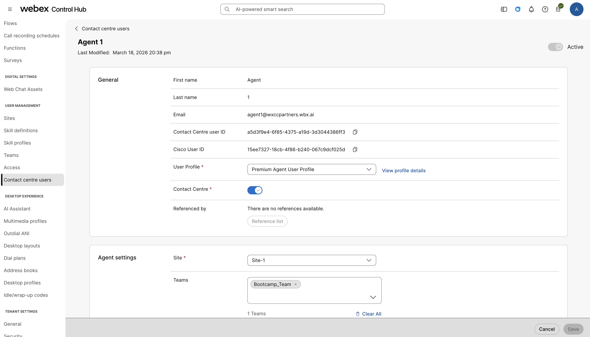](assets/image5.png)

### Create Out-Dial Queue

1. Navigate to **Contact Center** > **Queues**.
2. Click **Create Queue** and select **Outbound** as the queue type.
3. Fill in the required details and associate the team created above.

[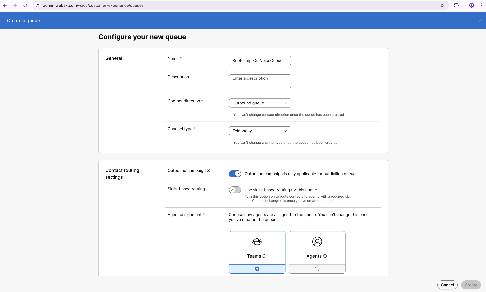](assets/image6.png)

[](assets/image7.png)

### Configure Global Variables

Global variables refer to attribute values that identify a customer during calls with agents. These variables will be used by the AI Agent in Lab 2 and displayed on the Agent Desktop.

1. Navigate to **Contact Center** > **Flows** > **Global Variables**.
2. Create the following two variables:

| Variable Name | Description |
|---|---|
| `firstName` | Customer first name, passed from the contact list |
| `lastName` | Customer last name, passed from the contact list |

[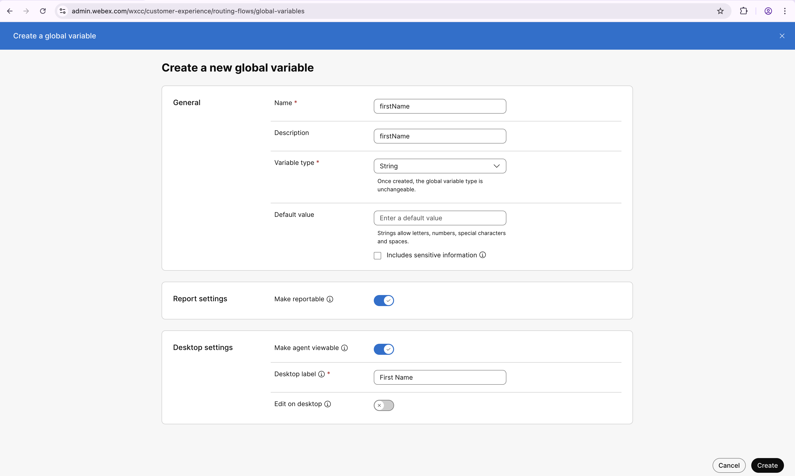](assets/image8.png)

---

## Lab 1.2 - Create the Dummy Validation Flow

Before creating the campaign flow, you will create a simple "dummy" flow to validate the end-to-end campaign setup. This flow will be used as the destination of the outbound call during this lab and will be replaced by the AI Agent flow in Lab 2.

???+ info
    Make sure you add `firstName` and `lastName` as **Global Variables** in the flow configuration.

1. Navigate to **Contact Center** > **Flows** and click **Create Flow**.
2. Give it a meaningful name (e.g. `Dummy_Lab1_Validation`).
3. Add the `firstName` and `lastName` Global Variables to the flow.

[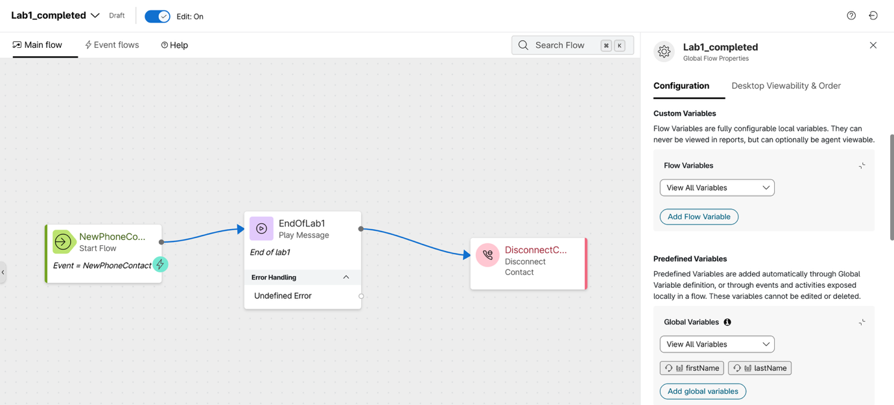](assets/image9.png)

4. Add a **Play Message** node and configure a Text-to-Speech message:

    ```
    Congratulations, you have completed Lab 1.
    ```

5. **Save** and **Publish** the flow.

[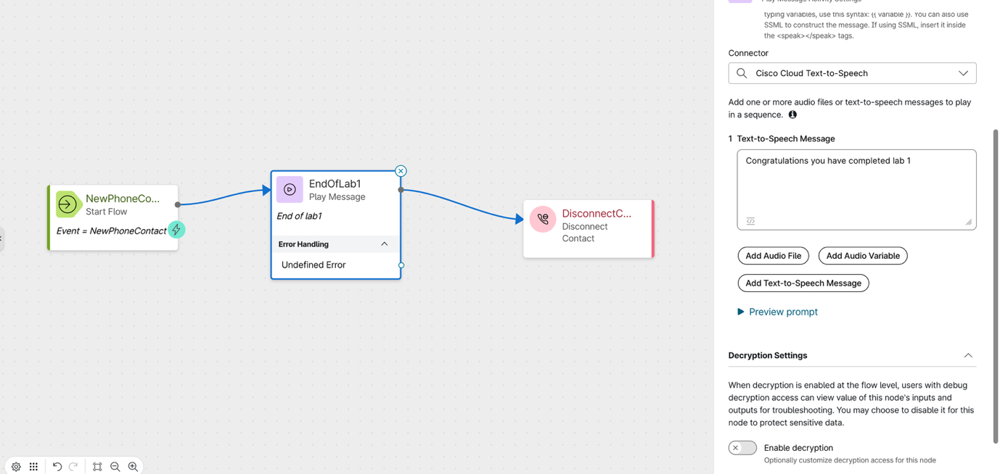](assets/image10.png)

---

## Lab 1.3 - Create the Outbound Campaign Flow

The outbound campaign flow is the core of the Lab 1 configuration. This flow handles the lifecycle of the outbound call and routes answered calls to the appropriate destination based on the call result.

### Main Flow Configuration

1. Navigate to **Contact Center** > **Flows** and click **Create Flow**.
2. Give it a name (e.g. `Outbound_DebtCollection`).
3. Add the `firstName` and `lastName` **Global Variables** to the flow configuration.

[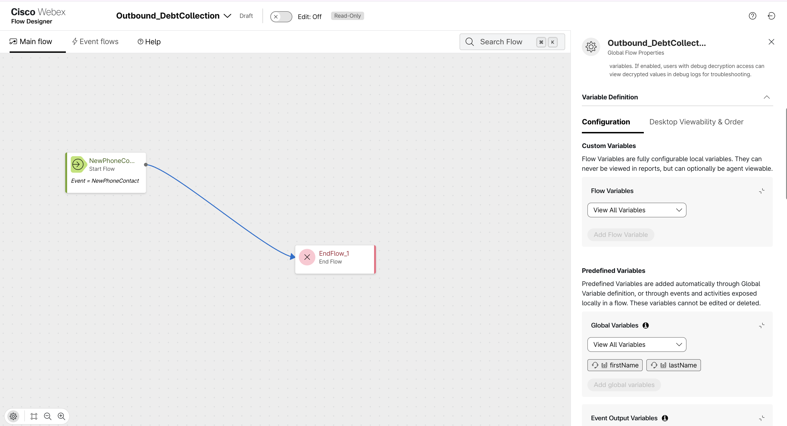](assets/image11.png)

### Event Flows Configuration

The outbound campaign flow uses **Event Flows** to handle different call outcomes. Click on the **Event Flows** tab and configure the following events.

[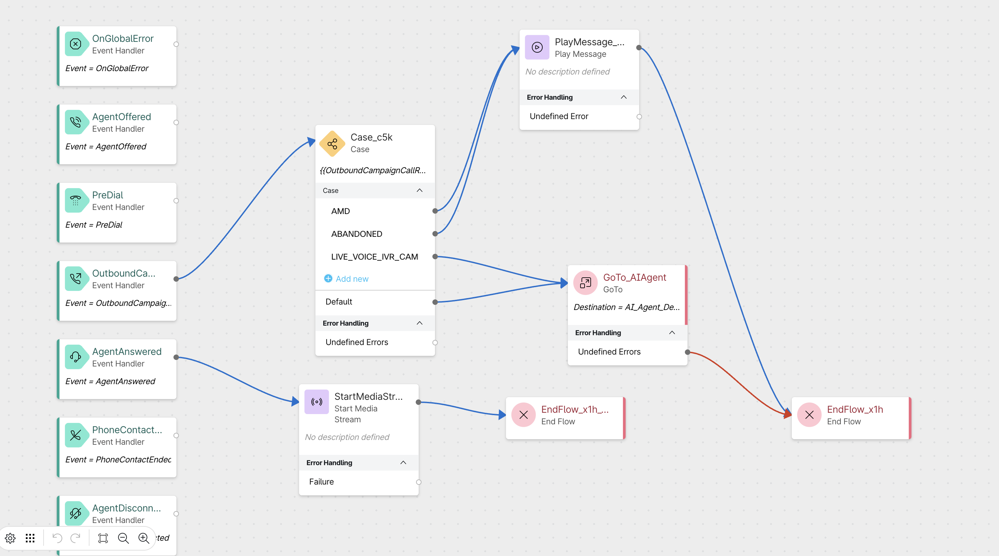](assets/image12.png)

#### OutboundCampaignCallResult Event

This event handles the result of each dialled call attempt. You will focus on two key events.

[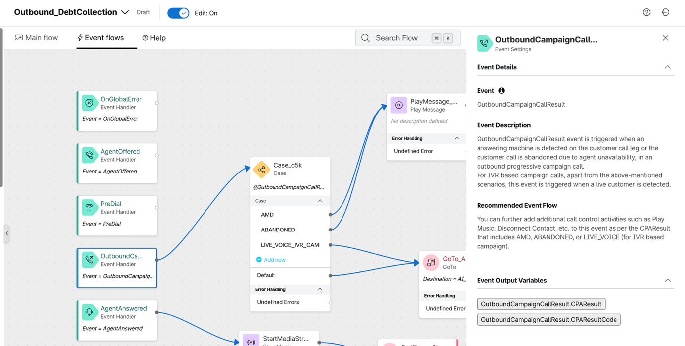](assets/image13.png)

**Step 1: Add a Case Node**

Connect the `OutboundCampaignCallResult` event to a **Case** node. Create **3 outputs** and map the `CPA` variable (Call Progress Analysis) from the previous node:

| Case Output | Value |
|---|---|
| `AMD` | Answer Machine Detection |
| `Abandoned` | Call was abandoned |
| `Live_Voice_IVR_CAM` | Live voice detected |

[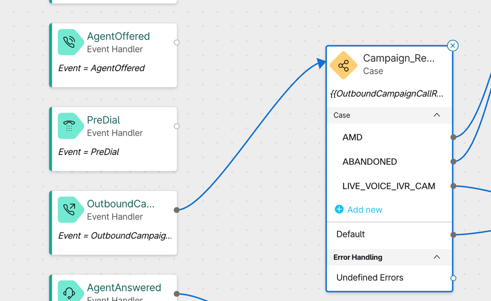](assets/image14.png)

[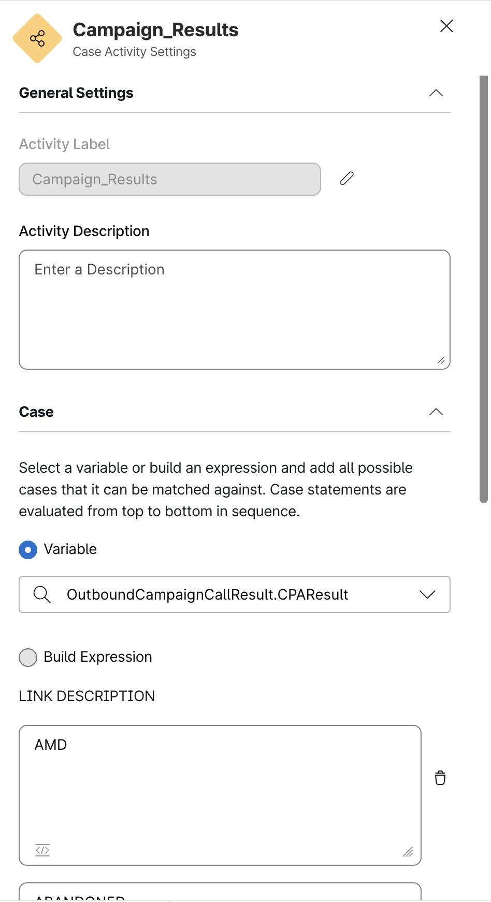](assets/image15.png)

**Step 2: Handle AMD and Abandoned Outcomes**

Connect the `AMD` and `Abandoned` outputs to a **Play Message** node configured with Text-to-Speech:

```
Goodbye.
```

[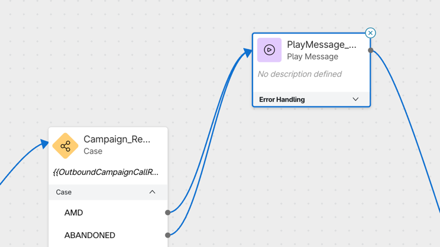](assets/image18.png)

[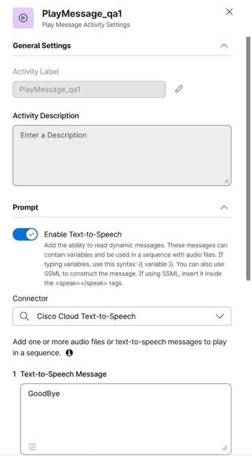](assets/image19.png)

**Step 3: Handle Live Voice**

Connect the `Live_Voice_IVR_CAM` output to a **Go To** node. This node will trigger the destination flow.

At this point, you haven't configured the AI Agent yet, so point the **Go To** node to the **dummy flow** you created in Lab 1.2.

???+ warning
    Make sure you **map the Global Variables** (`firstName`, `lastName`) from the current flow to the destination flow. This is required for Lab 2.

[](assets/image22.png)

[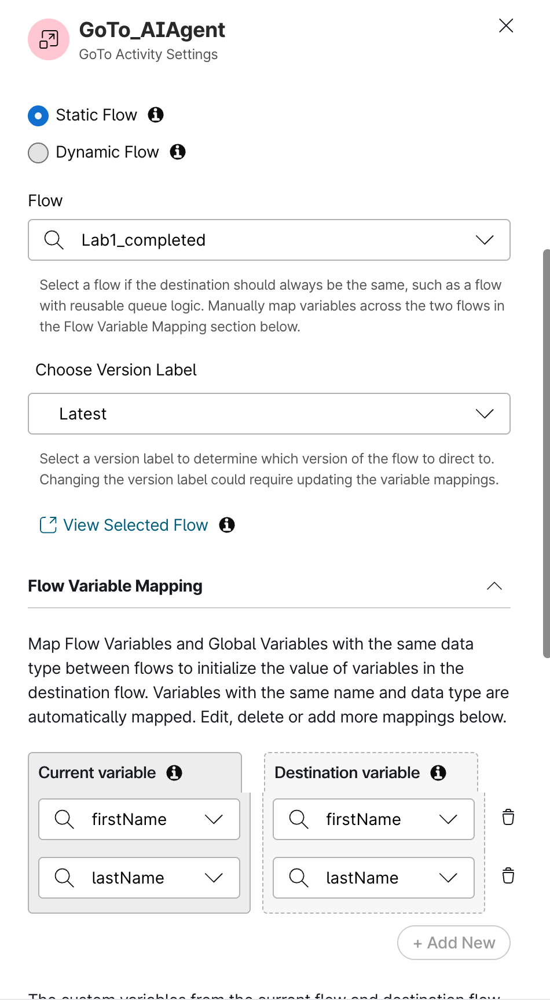](assets/image23.png)

#### AgentAnswered Event

The AgentAnswered event is used to start AI Assistant features as part of the use case.

1. Connect the `AgentAnswered` event to a **StartMediaStream** node.

[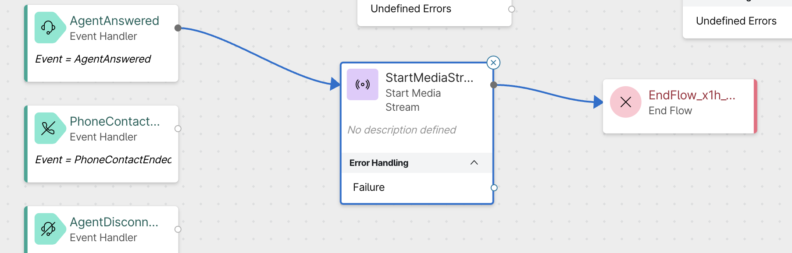](assets/image26.png)

---

## Lab 1.4 - Create the Entry Point and Outdial ANI

### Create the Entry Point (Channel)

The Entry Point (Channel) is where you specify the type of channel and associate the flow and queue.

1. Navigate to **Contact Center** > **Channels** and click **Create Channel**.
2. Fill in the following details:

| Parameter | Value |
|---|---|
| **Channel Type** | `Outbound Telephony` |
| **Flow** | Select the `Outbound_DebtCollection` flow |
| **Outbound Queue** | Select the out-dial queue created previously |

[](assets/image27.png)

### Configure Outdial ANI

The campaign needs a PSTN number to display for outbound calls. Configure an **Outdial ANI** in Control Hub.

1. Navigate to **Contact Center** > **Outdial ANI**.
2. Create a new ANI entry with a valid PSTN number.

[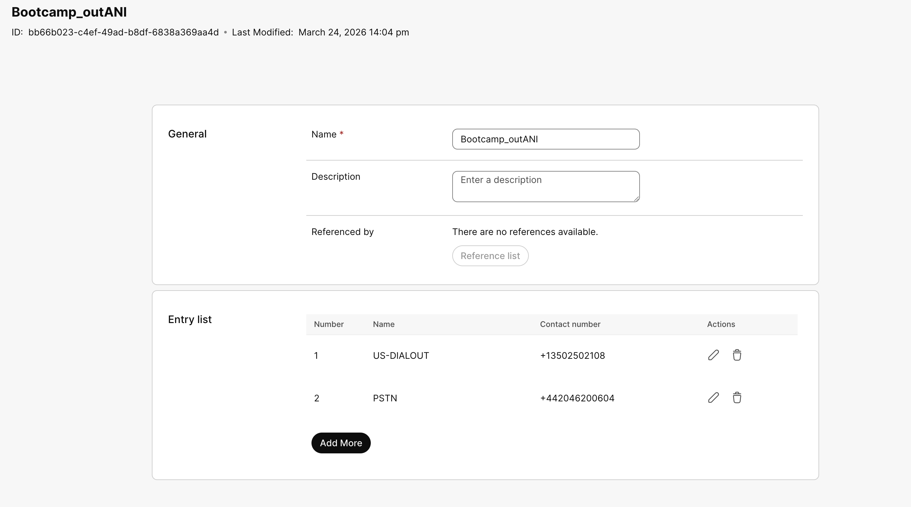](assets/image29.png)

---

## Lab 1.5 - Configure Business Hours

Campaign Manager takes the Business Hours configuration from WxCC. You can only enable or disable individual days within Campaign Manager.

1. Navigate to **Control Hub** > **Contact Center** > **Business Hours**.
2. Create a Business Hours schedule.

[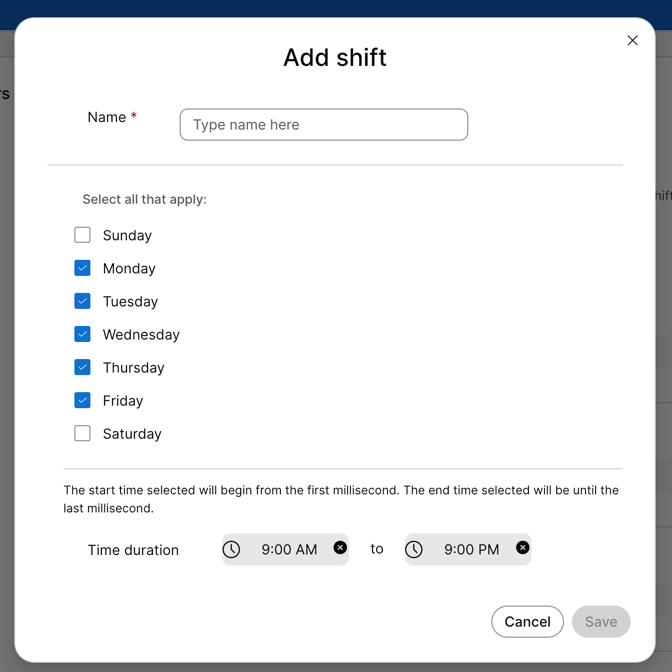](assets/image30.png)

[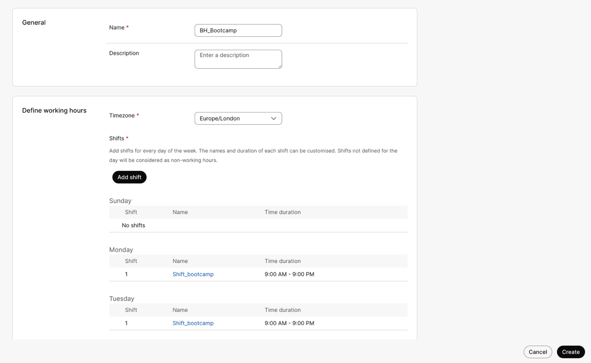](assets/image31.png)

???+ info
    For simplification purposes we won't configure any Holidays or Overrides.

---

## Lab 1.6 - Configure Campaign Manager Pre-requisites

Before creating the campaign, you need to configure several pre-requisite resources in the **Webex Campaign Management** portal.

[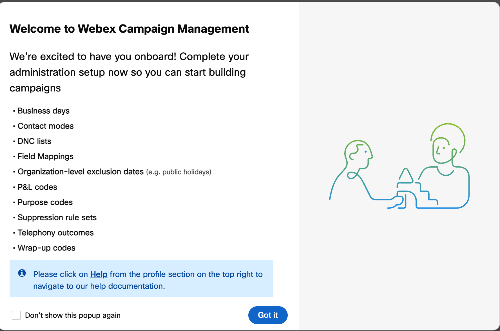](assets/image32.png)

### Business Days

Business Days come from Control Hub (configured in Lab 1.5). In Campaign Manager you can only enable or disable them.

1. In Campaign Manager, navigate to **Business Days**.
2. Enable **Monday to Friday**.

[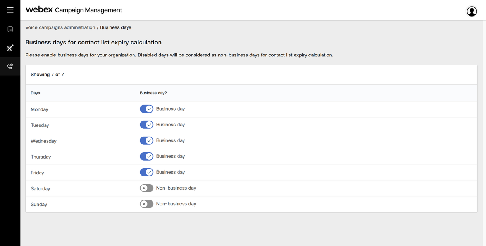](assets/image33.png)

### Contact Modes

Contact Modes allow you to define the type of phone number in your contact list (e.g. Home, Office).

#### Create Contact Mode

Follow these steps to create a contact mode:

1. Navigate to **Voice Campaigns** > **Contact Modes** and click **Create contact mode**.
2. Enter the following details:

| Parameter | Value |
|---|---|
| **Contact mode name** | A meaningful name (e.g. `Mobile`) |
| **Description** | Enter a meaningful description |
| **Minimum length** | Keep the default value |
| **Maximum length** | Keep the default value |

[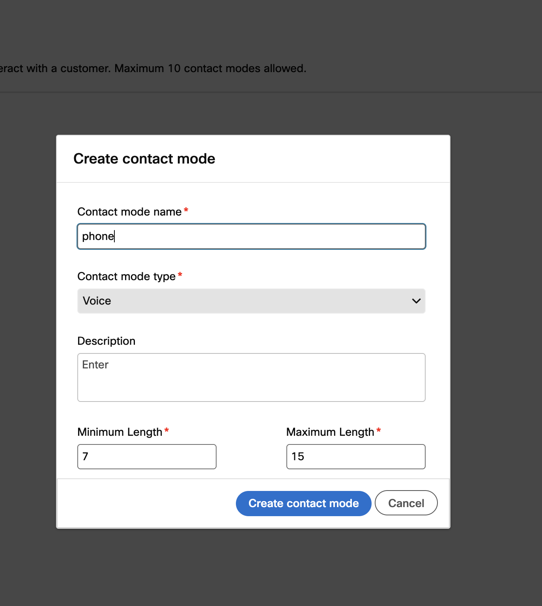](assets/image34.png)

### DNC Lists

Webex Campaign Management allows you to create and manage multiple DNC (Do Not Contact) lists. Contacts in DNC lists are excluded from Target Groups before a campaign is deployed.

???+ info
    For the purpose of this lab, we won't be configuring any DNC lists.

### Global Variables

Global variables refer to the attribute values that identify a customer during calls. Webex Campaign receives these variables from Control Hub.

[](assets/image35.png)

???+ info
    When a new tenant is created, you must designate global variables as **customer-unique-identifier** and **account-unique-identifier** to enable compliance with call attempt regulations. For this lab, since we are not using a unique identifier, we will not configure it.

### Field Mappings

Field Mappings define the structure of the contact list file. You map the headers of your CSV file to the fields of the dialler system.

**Step 1:** Create a Contact List CSV file with the following structure:

[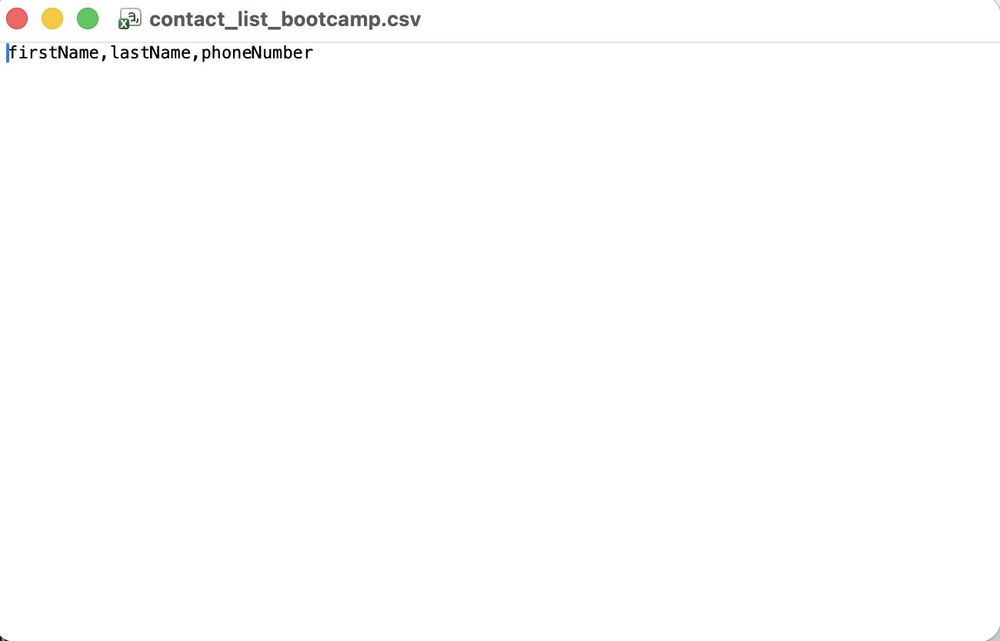](assets/image36.png)

**Step 2: Upload sample file**

1. Navigate to **Field Mappings** and click **Create field mapping**.
2. Click **Choose file** and select your CSV file.
3. Once uploaded, the screen will display the list of headers and the field separator.

[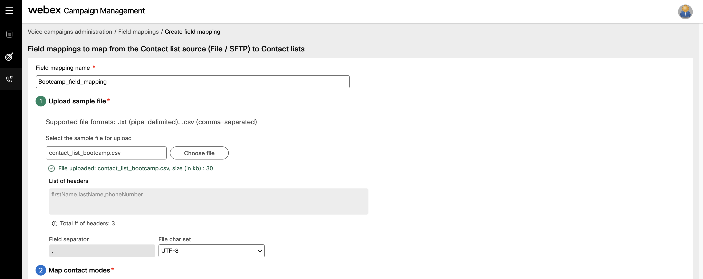](assets/image37.png)

**Step 3: Map contact modes**

Select the appropriate contact mode from the drop-down for each header. This ensures the correct number is dialled based on the schedule.

[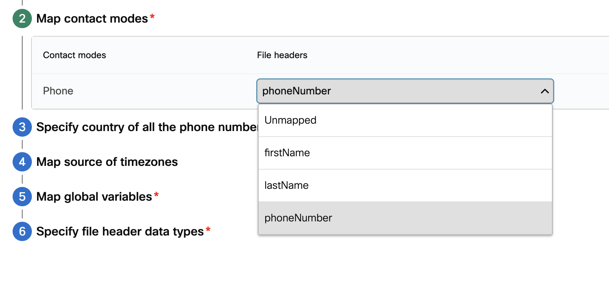](assets/image38.png)

**Step 4: Specify country and phone number format**

Select the country and the phone number format. Use the format with `+`.

[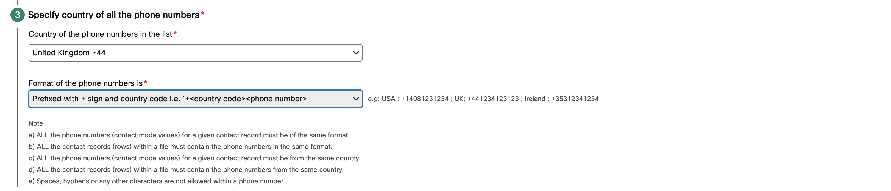](assets/image39.png)

**Step 5: Map source of timezones**

Keep the default configuration.

**Step 6: Map Global Variables**

Select the appropriate CSV header from the drop-down to map it with the respective Global Variables created in Control Hub (`firstName`, `lastName`).

[](assets/image40.png)

**Step 7: Specify file header data types**

The system auto-populates the data types based on your file. Leave all headers as `String` (default).

[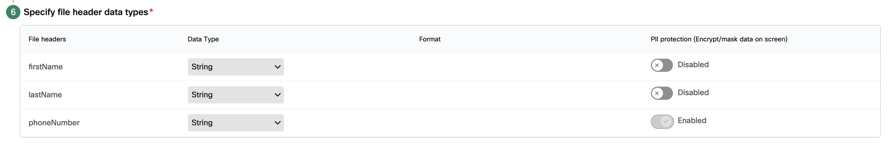](assets/image41.png)

### Org Exclusion Dates

Organization-level exclusion dates prevent campaigns from running on specific days such as national holidays. These apply to all campaigns.

1. Navigate to **Org Exclusion** and add an exclusion date.
2. Use `31/12/2026` as the exclusion date for this lab.

During exclusion dates, running campaigns change their status to **Pending** and execution stops. Once the exclusion date expires, the campaign automatically resumes its **Running** status.

[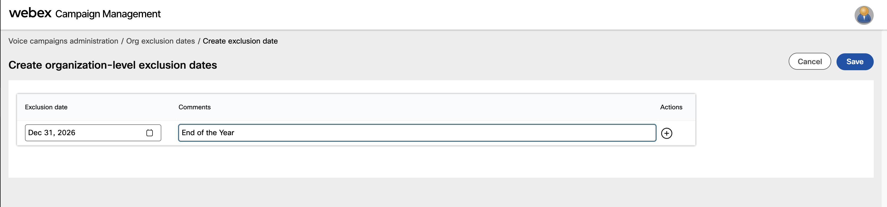](assets/image42.png)

### Purpose Meta-tags

Purpose meta-tags allow you to categorize campaigns by business type. During campaign activation, you tag the campaign with one or more purposes.

???+ warning
    Purpose meta-tags are **not mandatory** to create a campaign, but they are **mandatory** to activate one.

1. Navigate to **Purpose Meta-tags** and click **Create**.
2. Create a tag called `debt`.

[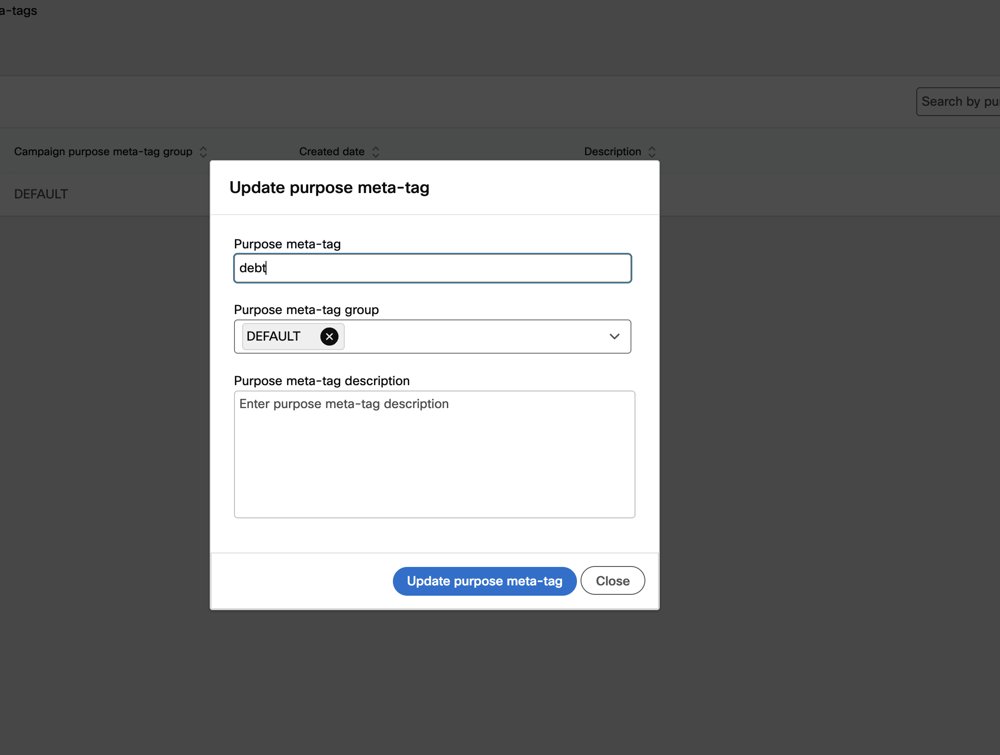](assets/image43.png)

### P&L Meta-tags

P&L (Profit and Loss) tags allow a business to assign a campaign to different divisions, cost centers, or products.

???+ warning
    P&L meta-tags are **not mandatory** to create a campaign, but they are **mandatory** to activate one.

1. Navigate to **P&L Meta-tags** and click **Create**.
2. Create a tag called `debt`.

[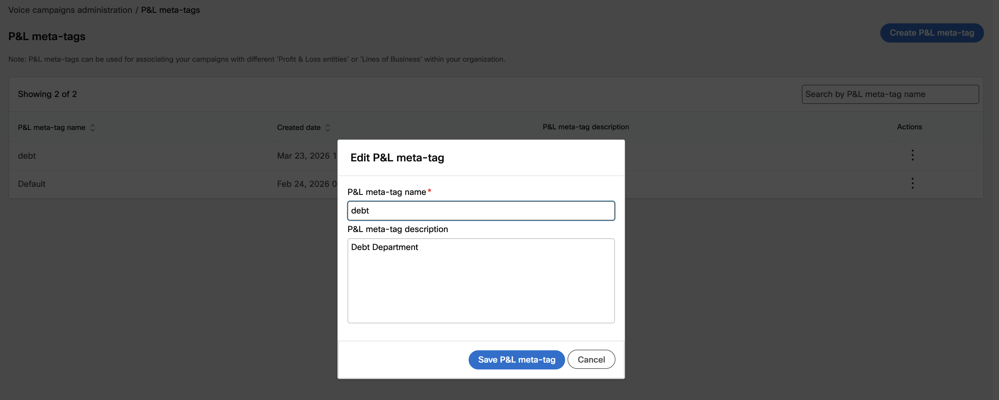](assets/image44.png)

### Suppression Rules

Suppression rules ensure compliance with regulations by defining when calls should not be attempted. We will configure a rule to prevent campaigns from running overnight.

1. Navigate to **Suppression Rules** and click **Create**.

[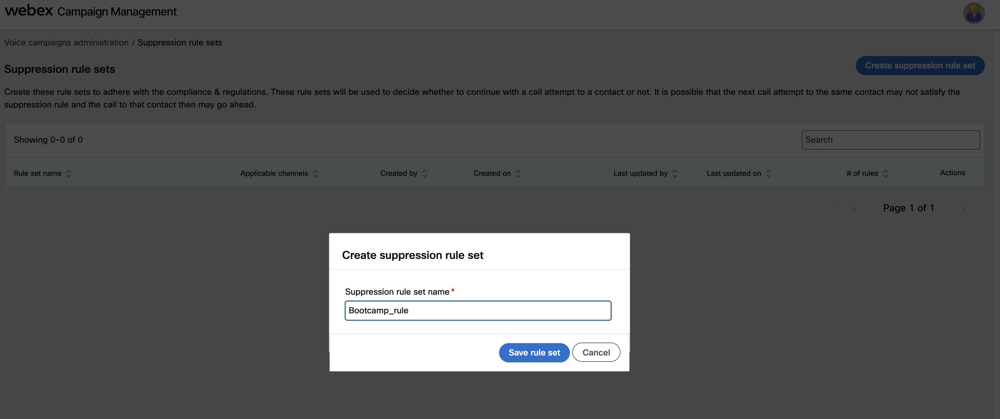](assets/image45.png)

[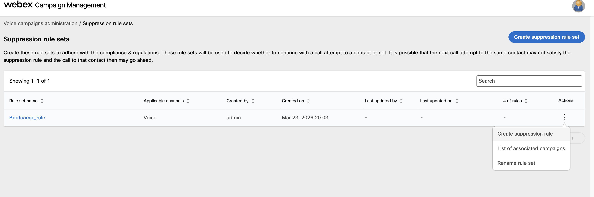](assets/image46.png)

[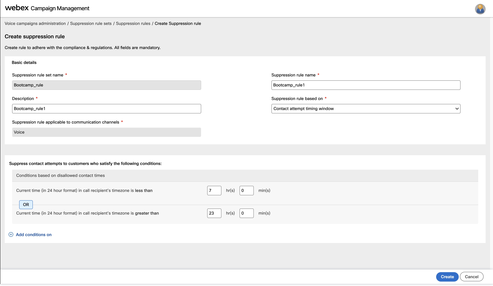](assets/image47.png)

### Telephony Outcome

A telephony outcome set is a collection of possible call results from the dialler (connected, rejected, busy, failed, etc.).

1. Navigate to **Telephony Outcomes**.
2. **Duplicate** the default outcome set created by the system and leave the default values for each outcome.

[](assets/image48.png)

[](assets/image49.png)

[](assets/image50.png)

[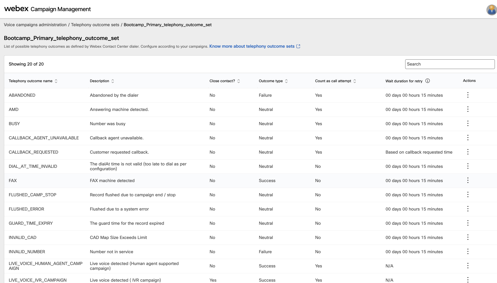](assets/image51.png)

### UI Users

Users are created and managed in Webex Control Hub. A user created in Control Hub with appropriate permissions will be able to access Webex Campaign.

???+ info
    Webex Campaign Management does not perform automatic user synchronization from Webex Control Hub. User accounts are provisioned dynamically at runtime — specifically, when a user attempts to log in. The application performs a just-in-time (JIT) sync to create the user profile within Webex Campaign Management as per the role available in Webex Control Hub.

    For more information refer to [https://docs-campaign-for-contact-centers.webexcampaign.com/docs/ui-users](https://docs-campaign-for-contact-centers.webexcampaign.com/docs/ui-users)

[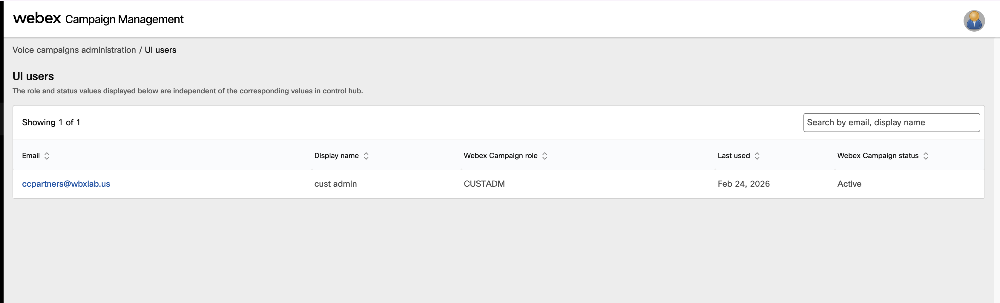](assets/image52.png)

### Wrap-up Code Sets

Wrap-up codes are tags applied by agents after a call to categorize and record the outcome of each customer interaction. These codes are defined and managed in Control Hub.

???+ info
    Although you can periodically fetch and update wrap-up codes in Webex Campaign, new codes cannot be created directly within Webex Campaign. Any changes made to a wrap-up code within Webex Campaign will not be overwritten during subsequent synchronizations with Control Hub.

    For more information refer to: [https://docs-campaign-for-contact-centers.webexcampaign.com/docs/wrap-up-code-sets](https://docs-campaign-for-contact-centers.webexcampaign.com/docs/wrap-up-code-sets)

For this lab, configure only one wrap-up code called `debt`.

[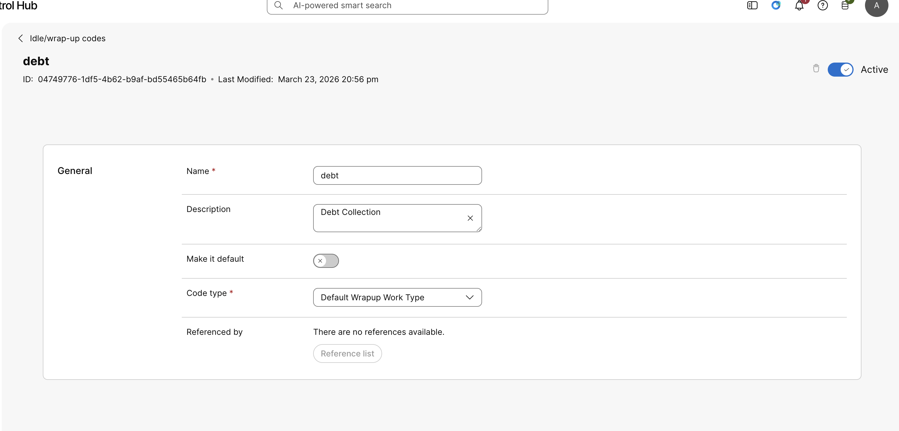](assets/image53.png)

---

## Lab 1.7 - Create and Configure the Campaign

A campaign group must be created first — it acts as a "wrapper" within which campaigns are created. A single campaign group can contain multiple campaigns.

### Create a Campaign Group

1. Navigate to **Campaign Management** and click **Create Campaign Group**.

[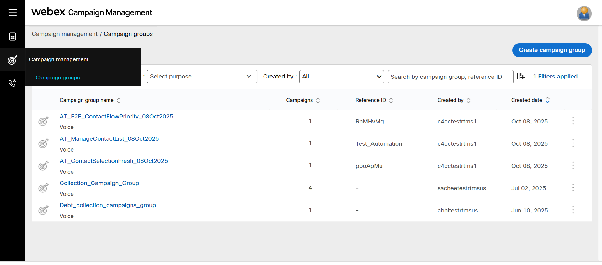](assets/image54.png)

2. The only mandatory field is the **Group Name**. Fill it in and click **Save**.

[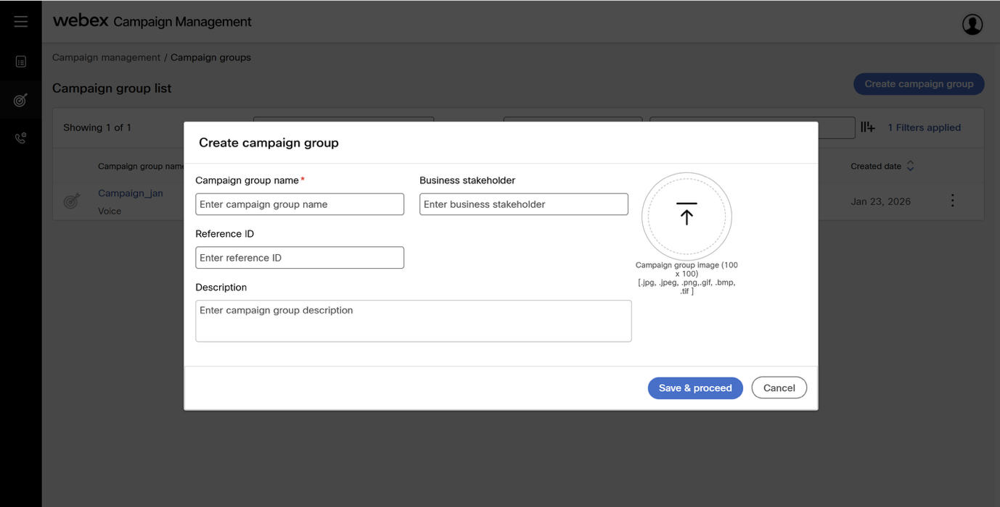](assets/image55.png)

3. Once created, the group will be listed in the Campaign Management section.

[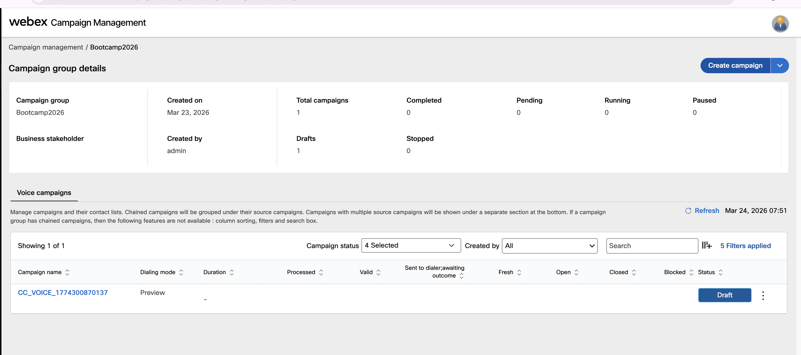](assets/image56.png)

### Configure the Campaign

Click on the new campaign group to access the campaign configuration wizard.

#### Node 1: Dialer Configuration

Select the **Entry Point** and **Outdial ANI** created previously in Control Hub.

- **Campaign Type**: `Progressive IVR`
- **CPA Parameters**: Leave enabled (default)

[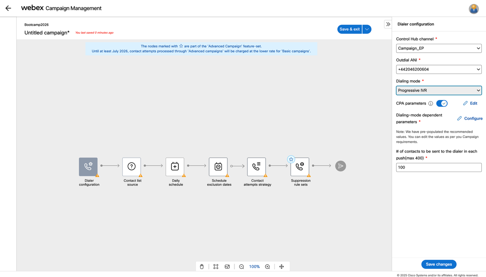](assets/image57.png)

#### Node 2: Contact List Source

Select **Manual Upload** as the source and associate the **Field Mapping** created earlier.

[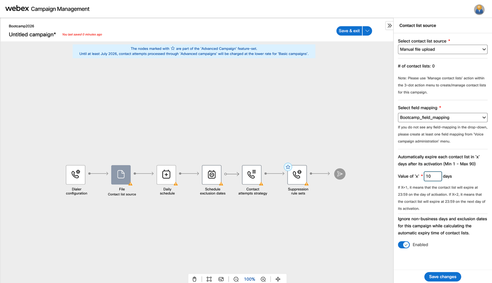](assets/image59.png)

#### Node 3: Daily Schedule

Configure the daily schedule for the campaign. Use the values shown below and make sure to use your own **Time Zone**.

[](assets/image61.png)

#### Schedule Exclusion Dates

Select the **exclusion date** configured previously (`31/12/2026`).

[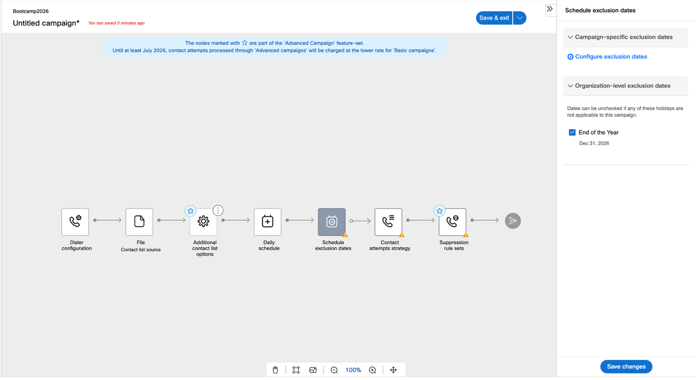](assets/image63.png)

#### Node 4: Contact Attempt Strategy

Configure the contact attempt strategy as shown below.

[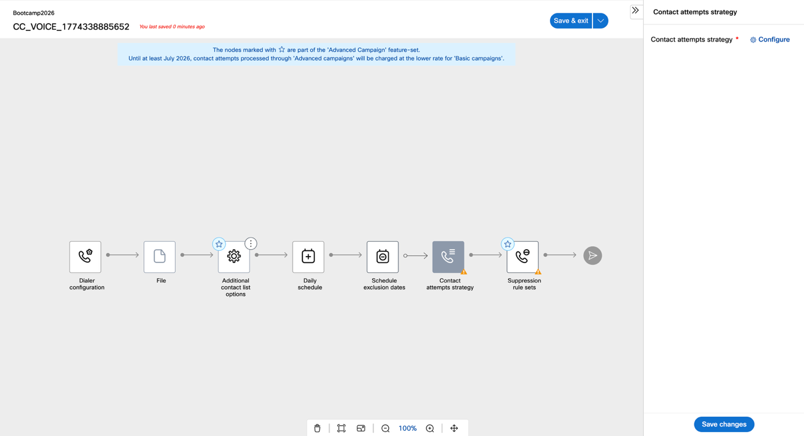](assets/image64.png)

Add the **wrap-up code set** and select the **telephony outcome set** configured earlier. The contact modes are pre-populated based on the field mapping selected.

Configure the max attempts and sequential dialling settings as shown below. For this lab, **disable** the sequential dialling option.

[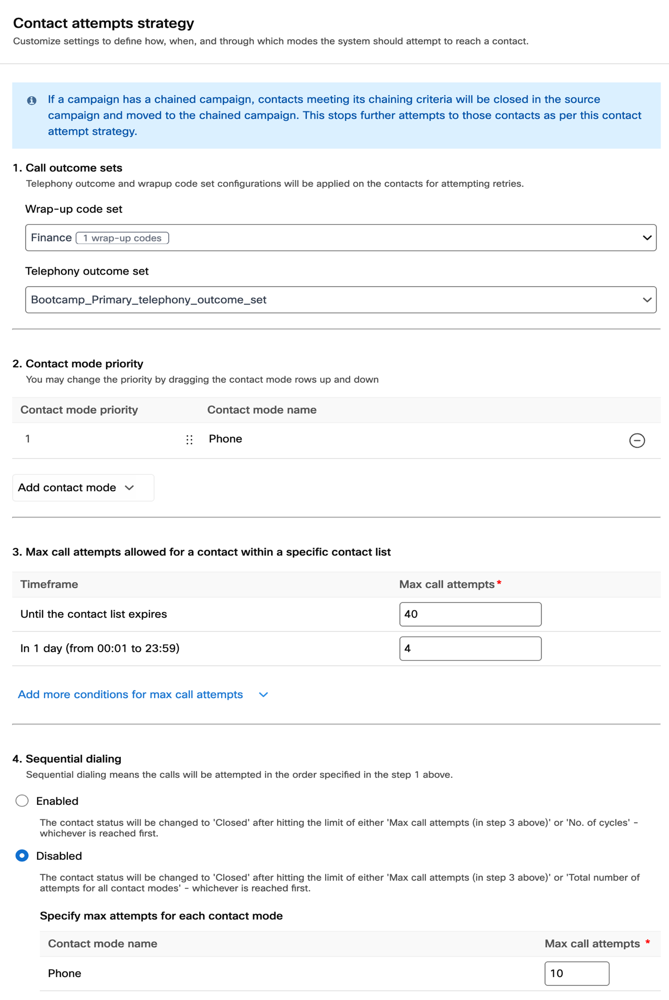](assets/image66.png)

#### Node 5: Suppression Rules

Add the suppression rule created previously. Then **save the campaign**.

[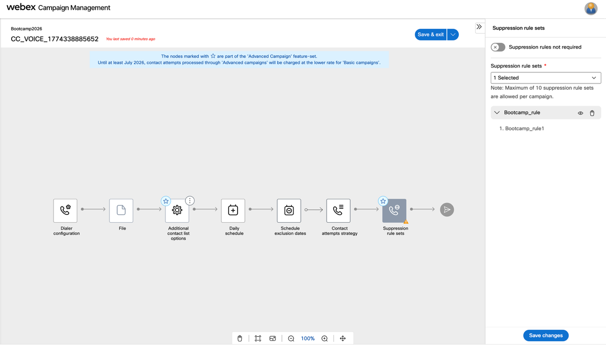](assets/image68.png)

#### Final Configuration: Name and Meta-tags

Before saving, configure the final campaign name and associate the **P&L** and **Purpose** meta-tags created previously.

[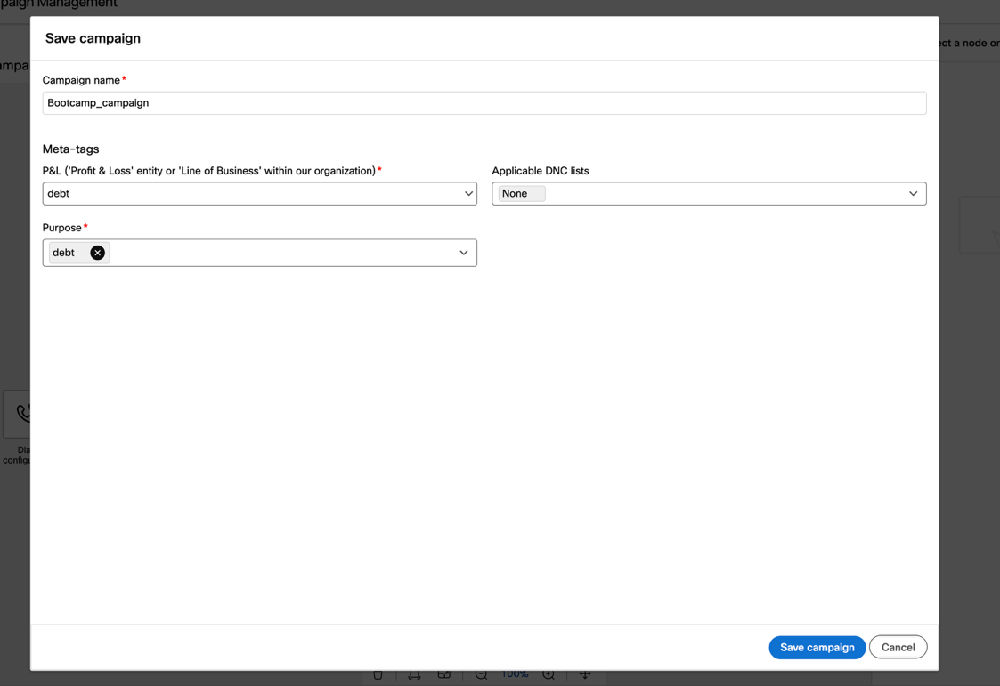](assets/image70.png)

---

## Lab 1.8 - Activate the Campaign and Upload the Contact List

### Activate the Campaign

Once all nodes are configured, activate the campaign.

[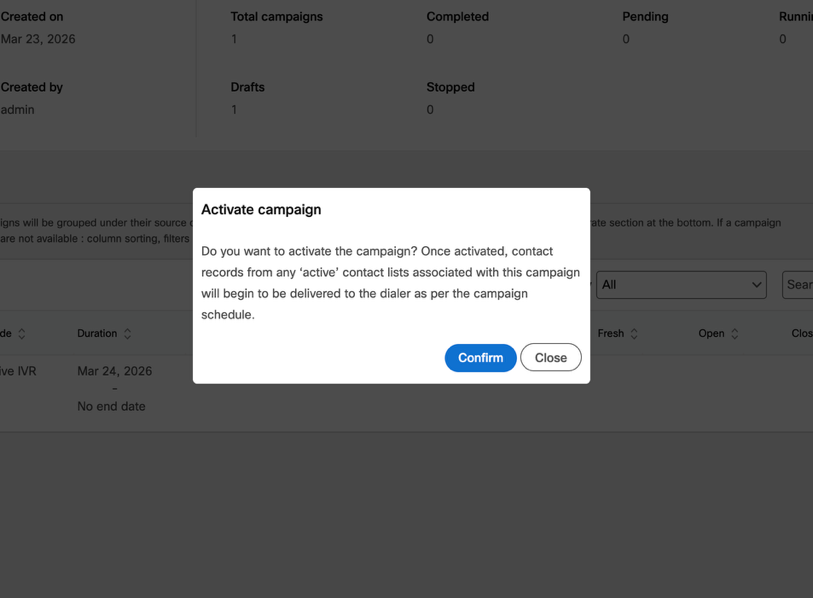](assets/image72.png)

[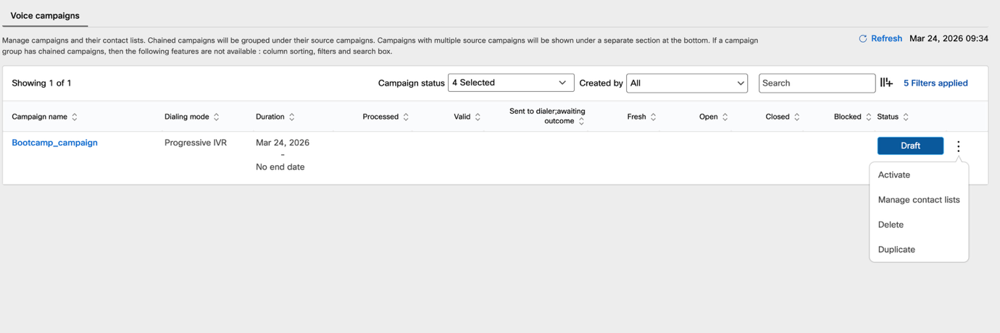](assets/image73.png)

[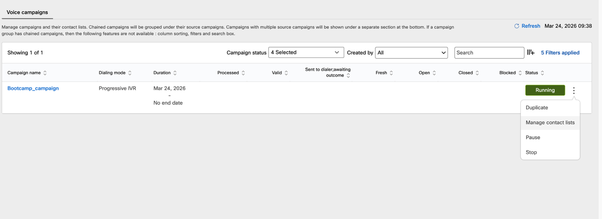](assets/image76.png)

[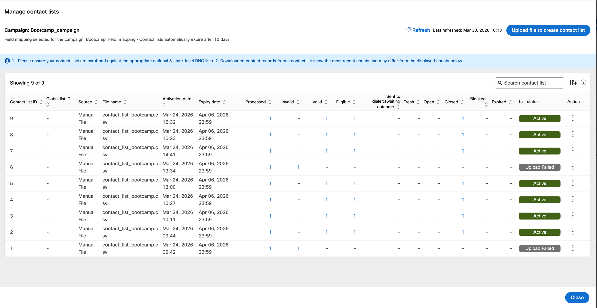](assets/image77.png)

### Upload the Contact List

Once the campaign is active, upload your contact list.

???+ info
    Contact lists can also be uploaded using APIs. For more information, refer to the Webex Campaign API documentation.

1. Navigate to the campaign's **Contact Lists** section and click **Upload**.
2. Select the CSV file created earlier. All other configurations remain as default.

[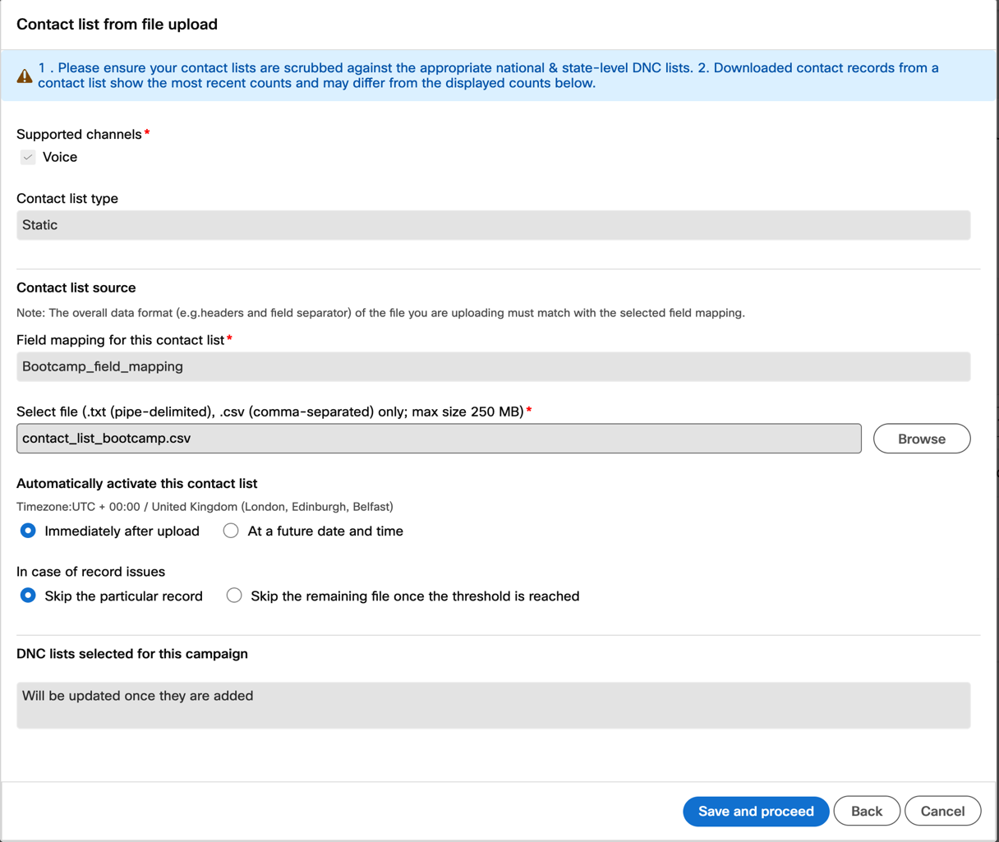](assets/image80.png)

3. The initial status will show as **Uploading**.

[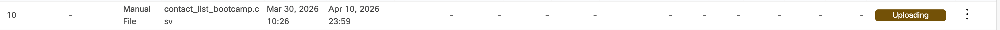](assets/image82.png)

4. If your file is valid, it will be processed and shown as **Valid**. The campaign will then initiate calls within **2 to 5 minutes**.

[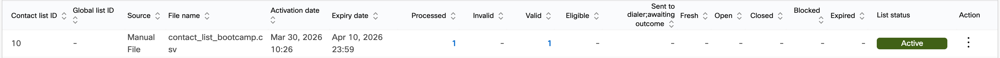](assets/image83.png)

???+ warning
    If the file cannot be uploaded, it is likely a formatting issue with the CSV. Check the file structure against the field mapping configuration.

---

## Testing 🧪

### Validation Steps

1. **Trigger the campaign**: Upload a valid contact list with at least one entry containing your test phone number.
2. **Wait for the call**: The campaign will dial your number within 2 to 5 minutes of the contact list being validated.
3. **Confirm the result**: Answer the call. You should hear the Text-to-Speech message:

    ```
    Congratulations, you have completed Lab 1.
    ```

4. **Check campaign status**: Navigate to the Campaign Manager portal and verify the campaign status and call attempt results.

---

## Lab Completion ✅

At this point, you have successfully:

* Configured **Agents, Teams, Out-Dial Queues, and Global Variables** in Webex Control Hub.
* Created a **dummy validation flow** and an **outbound campaign flow** with event handling for AMD, Abandoned, and Live Voice outcomes.
* Configured an **Entry Point** and **Outdial ANI** for the outbound campaign.
* Set up all **Campaign Manager pre-requisites**: business days, contact modes, field mappings, org exclusions, meta-tags, suppression rules, telephony outcomes, and wrap-up code sets.
* Created, activated, and tested a **Progressive IVR outbound campaign**.

**Congratulations!** You now have a fully operational proactive outbound reach capability in place. You are now ready to move on to the next lab, where you will add an AI Agent to handle the outbound calls.

[Next Lab: Lab 2 - Automated Debt Collection](../lab2_debt_ai_agent/index.md)
