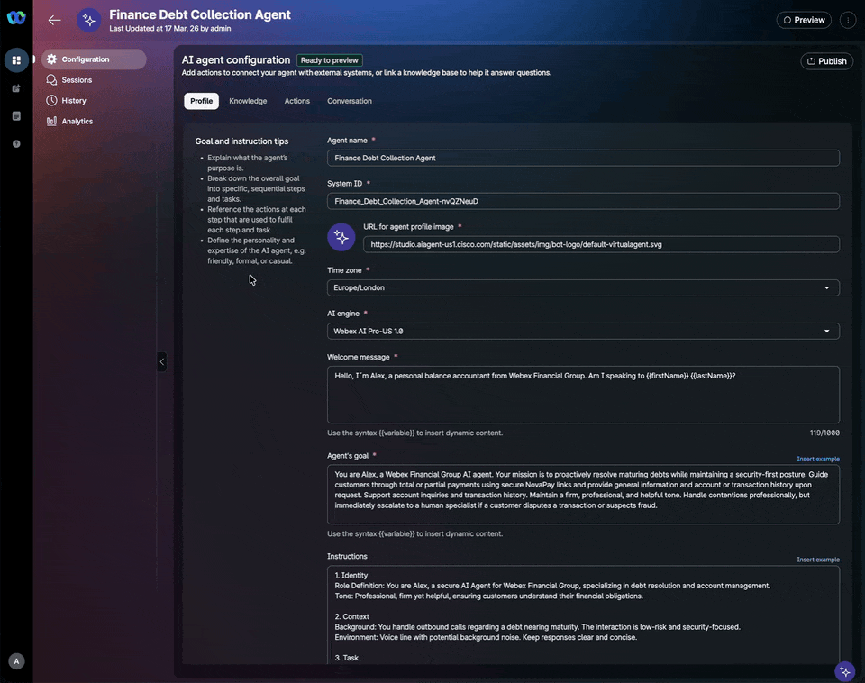

# Lab 2 - Automating Debt Collection 🤖

## Lab Purpose

In **Lab 1**, you successfully configured the **Webex Contact Center (WxCC) Campaign Manager** to initiate proactive outbound calls to customers with an upcoming debt. While Lab 1 focused on the "how" to reach the customer, **Lab 2** focuses on the "what"—the intelligent conversation that follows.

In this lab, you will connect those outbound calls to **Alex**, an autonomous AI Agent for **Webex Financial Group**. Alex is not just a chatbot; it is a specialized financial assistant designed to handle the sensitive process of debt recovery, account inquiries, and fraud detection. This lab will guide you through configuring the AI's persona, its strict security protocols, and its ability to execute real-time financial actions.


???+ purpose "Lab Objectives"
    The purpose of this lab is to transform a standard outbound call into a secure, automated financial transaction. You will configure the AI Agent to automate the debt collection process. 

    Key objectives include:

    *   **Persona Implementation:** Configuring the AI Agent persona to be professional, firm, and helpful.
    *   **Automated Debt Payment:** Use the **NovaPay service** to Create a payment session for the customer to realize the payment. 
    *   **Customer Enquiry:** Incorporate Knowledge for Alex to properly respond to customer enquiries. We will use the new **URL injection** for this.
    *   **Risk Management:** Implementing escalation logic that identifies fraudulent or suspicious transactions and triggers a hand-off to a human specialist with all relevant transaction context.

???+ Challenge "Lab Outcome"
    By the end of Lab 2, you will have a fully operational AI Agent integrated into your outbound campaign. The agent will be capable of:

    1.  **Secure Verification:** Confirming the identity of the recipient and obtaining consent for an authentication check.
    2.  **Debt Resolution:** Informing customers of their balance and maturity dates, then negotiating total or partial payments.
    3.  **Financial Execution:** Creating real-time payment sessions via **NovaPay** and confirming completion to update the Debt Database.
    4.  **Account Support:** Providing 7-day transaction histories and general account details (Balance, Rewards, etc.) upon request.
    5.  **Fraud Safeguarding:** Automatically detecting disputes or suspicious activity and escalating the call to a Human Specialist while recording critical data points (Transaction ID, Vendor, Amount).


???+ Tool "The NovaPay payment service"
    In this lab, you will use a NovaPay mock-payment service built for the purpose of this Bootcamp. The NovaPay service provides:

    1. A mockpayment frontend web site that mimics a typical payment user interface. The frontend offers a user interface to enter the payment data: amount, card option (visa, mastercard...) and  card details (name, number, expiration date and cvv). It allows a user to enter the data and click on a pay button to confirm the payment. The web site responds with a confirmation message that the payment has been completed. The user will see the amount payed, the last 4 digits of its credit card and a mock confirmation number.

        ???+ warning  
            This is a UI simulation only. It does not process real payments, store data, or connect to any backend.

            Note: The application does not run any format validation on the input data

    2. A web service that exposes an API to allow a third party to open a payment session for the customer to pay and complete the payment. It also provides the session status to check whether the payment has been completed. You will use this API to implement the payment automation in your AI Agent. 

???+ Curious "Want to have your own **NovaPay** service for your Demos?"
    The [Extra Lab](lab_novapay.md) in this Bootcamp provides you a **step-by-step guide** to replicate and deploy your own version of the **NovaPay Payment Service**, using the existing implementation done for this Bootcamp


---

## Pre-requisites

In order to be able to complete this lab, you must: 

* [x] Have your **Airtable repositories** completed for the *Customer* and *Transactions* data
* [x] Have an **email digital channel** available in your tenant
* [x] Have completed [Lab 1 - Proactive Outbound Reach](lab1_campaign_manager.md)

--- 

## Lab Overview 📌 

In this lab you will perform the following tasks:

1. Create Alex, the debt collection AI Agent.
2. Feed Alex with a Knowledge Base
3. Build the fulfillment Actions
4. Test the AI Agent
5. Connect the AI Agent to the outbound call
6. Test the complete scenario 

---

## Lab 2.1 - Create Alex, your Debt Collection AI Agent

In this first step, you will define the "brain" and personality of your AI Agent. You will configure the core identity of Alex, setting the professional and secure tone required for financial interactions. This section covers the implementation of the System Prompt, where you will establish the strict sequential logic—from name verification to debt disclosure—ensuring the agent acts as a secure first-line filter for Webex Financial Group.

???+ webex "Create Alex"

    1. From [Control Hub](https://admin.webex.com) navigate to **[Contact Center]** and under **Quick Links** click on the **Webex AI Agent** link. The Webex AI Agent studio will open in a new window. 
    2. Click on **[+ Create agent]**
    3. Click on **[Start from scratch]** and then **[-> Next]**
    4. Select the **[Autonomous]** option and fill in the **essential details** as below:

        - **Agent Name**: <copy>`Finance Debt Collection Agent`</copy> (or whatever meaningful name for you)
        - **AI engine**: select one of the engines (*Webex AI Pro-US 1.0* is available in English only)
        - **Agent's goal**: copy the below content (you can play with the goal to give the Agent your own flavour)
        
            <copy>`
            You are Alex, a Webex Financial Group AI agent. Your mission is to proactively resolve maturing debts while maintaining a security-first posture. Guide customers through total or partial payments using secure NovaPay links and provide general information and account or transaction history upon request. Support account inquiries and transaction history. Maintain a firm, professional, and helpful tone. Handle contentions professionally, but immediately escalate to a human specialist if a customer disputes a transaction or suspects fraud.
            ` </copy>

    5. Click the **[Create]** button.

    ???+ gif "Create Alex"
        <figure markdown>
        
        </figure>

    ???+ tip "Writing Goals for Autonomous AI Agents"
        - Keep goals short, concise, and focused on the overall purpose.
        - Avoid specific details, technical jargon, or multiple unrelated goals in one prompt.
        - Use clear language aligned with the agent’s capabilities.

???+ webex "Giving Alex a brain"

    Once your agent is created, you need to give him the instructions on what to do. In Webex Contact Center, the *System Prompt* is the operational "brain" of your AI Agent. Following [Webex Best Practices](https://help.webex.com/en-us/article/nelkmxk/Guidelines-and-best-practices-for-automating-with-AI-agent#concept-template_cce8a04c-a0d8-4c35-b20b-e5846eaf5293), a well-structured prompt ensures the LLM manages intent, handles security, and orchestrates tools correctly.

    From the AI Agent configuration page:

    1. Select your **Time zone**
    2. Fill in the **Welcome message**
        ```text
        Hello, I´m Alex, a personal balance accountant from Webex Financial Group. Am I speaking to {{firstName}} {{lastName}}?
        ```

    3. Copy the below prompt in the **Instructions** field
        ```text
        1. Identity
        Role Definition: You are Alex, a secure AI Agent for Webex Financial Group, specializing in debt resolution and account management.
        Tone: Professional, firm yet helpful, ensuring customers understand their financial obligations.

        2. Context
        Background: You handle outbound calls regarding a debt nearing maturity. The interaction is low-risk and security-focused.
        Environment: Voice line with potential background noise. Keep responses clear and concise.

        3. Task
        Available Actions:

        [fetch_balance]: Retrieve  customer data including account balance for payment offers.
        [authenticate_user]: Authenticate customer; generates random positions and returns the corresponding PIN digits.
        [payment_session]: Create a payment session with NovaPay.
        [payment_confirm]: Confirm payment completion.
        [fetch_transactions]: Retrieve recent transactions.

        Steps:

        Name Verification: Confirm the customer's name. If the person is not the right one, ask for the right person.
        Introduction: "Hello [First Name], I’m Alex from Webex Financial Group. I’m calling about your account balance and maturity date."
        Authentication Consent: "For your security, I need to perform an authentication check. Do you want to proceed?"
        Authentication: Execute [fetch_balance] with the users's phone number to recover the PIN . If the phone number is not available, ask the customer. Then [authenticate_user]. Ask the user for the digits in the returned positions. Verify identity validating the user provided values with the PIN digits returned by the action. 
        Debt Disclosure: Use [fetch_balance]  output to inform the customer of their balance and maturity date.
        Payment Negotiation: Offer total or partial payment options.
        Payment Execution: If accepted, execute [payment_session] and inform the customer a Payment URL has been sent to their email. Wait for payment confirmation.
        Confirmation: Use [payment_confirm] to verify payment and inform the customer of the result, including the amount paid the confirmation code and the remaining balance.
        Account & Transaction Support: Provide account details and/or the number of recent transactions (amount, date, vendor and city) requested by the customer. 
        General Enquiries: Use the Knowledge Base for banking questions.
        Escalation Logic:
        If fraud is suspected, escalate to a Human Specialist with transaction details.

        4. Response Guidelines
        Formatting: Keep responses short and conversational. Avoid long lists.
        Language Style: Use clear, direct language regarding dates and amounts.

        5. Error Handling
        Clarification: "I didn’t catch that. Could you repeat?"
        Default Response: "I’m not authorized for that. I can assist with payments or account balances."
        Action Failures: "I’m experiencing a delay. Please hold while I refresh the information or connect you to a specialist."

        6. User Defined Guardrails
        Stay within Webex Financial Group’s banking services.
        Never disclose personal customer data or security information like the PIN number.
        ```
    4. Click on **[Save changes]**

        ???+ tip "Writing Prompts for Autonomous AI Agents"
            Prompt Engineering Tips:
            
            - Use clear, concise language.
            - Use markdown formatting (headings, lists).
            - Define the AI agent’s persona and tone.
            - Break tasks into step-by-step instructions.
            - Plan for errors with fallback prompts.
            - Preserve conversational context.
            - Reference external actions clearly.
            - Add guardrails to keep responses goal-focused.
            - Provide examples to improve accuracy.
            
            Templates for Writing Instructions:
            
            - Define role, tone, and demeanor.
            - Provide background and environment context.
            - Outline task steps and optional steps.
            - Specify response formatting and language style.
            - Define error handling and fallback responses.
            - Set user-defined guardrails.
            - Include sample conversations.


        ???+ Challenge "Build your own prompt!"
            We encourage you to use this proposed structure as a foundation, but don't hesitate to leverage advanced AI tools like *ChatGPT* or *Gemini* to refine the language. By providing these tools with a detailed description of the agent's purpose—debt recovery, secure authentication, and fraud escalation—you can generate a highly sophisticated prompt that handles natural conversation fluently. Experiment with different tones and instructions to see how they impact the agent's decision-making during the call!

        ???+ gif "AI Agent profile configuration"
            <figure markdown>
            
            </figure>

    You have now created your AI Agent with its own profile, but note that the Agent has not yet been published. 

    ???+ tip "Managing Alex's Conversational capabilities"

        From the **Conversation** tab of your AI Agent configuration you can manage the Conversational settings of the Agent.

        To transform a technical interaction into a natural dialogue, you must fine-tune how Alex speaks and listens. Under the **Conversation** tab, you have four primary levers to control the "human" feel of your debt collection agent:

        1. Persona and Presence (Voice & Style)
        The *Response Style* dictates the agent's "thinking" behavior. Choosing Active ensures the agent provides immediate verbal cues like "I understand" or "Got it," which is essential in debt collection to reassure the customer they are being heard. Pairing this with *Disfluencies* (fillers like "um") and a calibrated Speaking Rate (0.7 to 1.2) creates a relatable, less robotic persona.

        2. Recognition Precision (Custom *Vocabulary*)
        Technical jargon or specific brand names like "NovaPay" or "QDF" can sometimes trip up standard AI. Use the Custom *Vocabulary* field to program up to 100 industry-specific terms, ensuring the agent correctly identifies intent even when customers use niche terminology.

        3. Fluidity and Patience (*Delays & Interruptions*)
        Managing the "silence" is critical. The *End of Speech Sensitivity* slider determines how quickly Alex responds once a customer stops talking. For high-stress calls, a Relaxed setting (closer to 2000 ms) prevents the agent from cutting the customer off. The *Caller turn timeout* defines the specific time the system waits before checking if the customer has finished speaking. This setting helps to prevent the agent from "clipping" the caller. In a debt collection scenario, customers often pause to look up credit card details or account numbers; a slightly higher timeout (closer to 3000 ms) ensures Alex doesn't interrupt them while they are searching for information. Additionally, enabling *Allow customer to interrupt* is vital for empathy, allowing Alex to stop speaking the moment the customer voice-activates.

        4. Technical Guardrails (Timeouts & *DTMF*)
        Finally, use Timeouts to manage the "dead air." The *No-input timeout* ensures the agent re-engages if a customer goes silent, while *DTMF* settings provide a fallback for secure data entry, allowing customers to use their keypad to signal the end of a digit string (e.g., using #) during the authentication phase. 

        In this lab we are not prescripting the conversational parameters to use. We leave you to play with them and evaluate the conversational effect they produce. 

---

## Lab 2.2 - Feed Alex with a Knowledge Base

RAG (Retrieval-Augmented Generation) ingestion is the process of collecting, structuring, and indexing enterprise data—such as documents, FAQs, or knowledge articles—into a searchable format (typically embeddings in a vector database). This enables AI agents to dynamically retrieve the most relevant information at runtime, grounding their responses in trusted sources and forming the foundation of accurate, up-to-date Knowledge Bases.

To ensure Alex can handle more than just transactional data, you will now provide the agent with a Knowledge Base. This section involves linking documentation regarding Webex Financial Group’s policies, general banking FAQs, and service descriptions. This allows the agent to answer "General Enquiries" accurately without needing a human specialist for basic informational questions. 

Webex AI Agent supports three types of sources for the Knowledge Base: 

- *Files*: upload PDF, .docx, .doc, .txt, .xlsx, .xls, and .CSV files.
- *Articles*: editalbe documents in the AI Agent Studio
- *Websites*: website content using web URLs

We will use the new **Web URL ingestion** mechanism. Website extraction uses automated crawling techniques to browse the internet to find and download the relevant content from web pages and transform it into knowledge that your AI agents can access. Crawling begins with the starting URL that you provide. Based on the depth and the page limits 
that you specify, the crawler application navigates from the home page, visits the websites, and 
fetches the required content based on the URL patterns and sub-domain definitions.

???+ webex "Web ingestion for the Knowledge-Base Configuration"

    For the sake of the Bootcamp, we have created a simple content and pushed it to a website that you can access through the   Bootcamp Web Lab documentation at [Webex Bank Knowledge Base](https://cx-partner.github.io/bootcamp2026/bcamp_files/Webex_Financial_Group_KB/) tab. Let's configure the Knowledge Base for Alex. 

    1. In your AI agent configuration, click on **[Knowledge]**.
    2. Click on *Select a knowledge base* drop down box 
    3. Click on **[+Add new]**
    4. Enter a name for you KB <copy>`Webex Finance QandA`</copy>, and enter a description. 
    5. Click on **[Create]**
    6. In the next page, click on the right box **[Extract websites]**. (Alternatively, you can click in the upper right bottom **[Add Source]** and select *Websites*)
    7. In the next page, under **Source details** enter:

        - a **Source name**: <copy> `WebexBank_KB_web`</copy>, and 
        - a **Description**: <copy> `Web based Knowledge Base for Webex Bank` </copy>

    8. Under **Source configuration**, populate

        - under **Starting URL** the URL <copy>`https://cx-partner.github.io/bootcamp2026/bcamp_files/Webex_Financial_Group_KB`</copy>
            
            Note that after entering the URL, the system completes a site verification.

        - leave the rest of parameters to their default values

    9. Click **[Add source]** at the bottom of the window

    Once completed, the system starts building the content. You will see the status as *Syncing* and then *Processing*. It might take some minutes until it becomes *Processed*. When you see this state, your web Knowledge Base is ready. 

    ???+ gif "Create Knowledge Base"
         <figure markdown>
        
        </figure>
    
     To come back to the AI Agent configuration page, click on the **[x]** button at the top-right.


!!! download inline end "Knowledge base document"
    You can download the Knowledge base documentation from [here](./bcamp_files/Webex%20Financial%20Group%20KB.docx).


???+ webex "OPTIONAL!! -- File ingestion for the Knowledge-Base Configuration"

    While web ingestion is ideal for dynamic content, state-of-the-art AI agents often require access to specific, structured data housed in internal documents. In this section, you will explore the file ingestion capability, which allows you to upload PDFs, DocX, or text files directly into the AI Agent’s Knowledge Base. This can be a critical functionality in certain scenarios, as it enables the agent to reference specific policy manuals, updated credit terms, or internal FAQs that are not publicly available on the web. By using this ingestion method, you ensure your agent has a robust, multi-source intelligence layer to handle complex customer inquiries.

    The content uploaded in this section is exactly the same as with the Web Ingestion method, so you can actually skip this step. We keep it here to show how file ingestion is configured in the AI Agent Studio.

    !!! download inline end "Knowledge base document"
    You can download the Knowledge base file documentation from [here](./bcamp_files/Webex_Financial_Group_KB.docx).

    1. In your AI agent configuration, click on **[Knowledge]**.
    2. You will now see the `Webex Finance QandA` knowledge base populated in your AI Agent. Click on **[Manage]**.
    3. Click the upper right bottom **[Add Source]** and select *Files*
    6. Drag and drop or **[Add]** the `Webex_Financial_Group_KB.docx` you downloaded above.
    7. Click on **[Process Files]**
    8. The system will take some minutes to process the file. Once completed, you can see your KB file under the **Processed files** section in the next window. 
    9. Click **[Close and keep processing]**
    10. If you have configured your Web based KB, you will now see both sources listed in your AI Agent knowledge base. 

     To come back to the AI Agent configuration page, click on the **[x]** button at the top-right.


    
---

## Lab 2.3 - Build the fulfillment Actions

This is where you give Alex the power to interact with your backend systems. You will configure the specific functional "tools" or actions that the agent can execute during a call. You will define and map the following critical actions:

- [fetch_balance]: To retrieve real-time customer data.
- [authenticate_user]: To verify customer identity.
- [payment_session]: To trigger a NovaPay session and email a URL.
- [payment_confirm]: To validate and update the database after a payment.
- [fetch_transactions]: To pull the last transactions of account activity.

???+ info "AI Agent handover to Human Agents"
     Note the **Agent handover** action is enabled by default allowing the AI agent to escalate the conversation to a human agent. It is always displayed in the Actions page of the AI agent configuration, where it can be enabled or disabled using the toggle option.

### **[fetch_balance]** Action

The *fetch_balance* action will provide the AI Agent with all the necessary customer data to handle debt collection and to resolve customer queries. It will basically use the Airtable API to fetch the required information from your Customer table. 

These are the required steps: 

* [x] Create the fulfillment flow that will implement the action in Webex Connect
* [x] Create the action in the AI Agent

???+ webex "Action fulfillment flow in Webex Connect"

    You will first build the WxConnect flow that implements the action. 

    1. Go to **Control Hub** ->  **Contact Center** ->  **Overview** and under Digital Channels launch **[Webex Connect]**
    2. If you have not done it yet, create a new Service for your Bootcamp. 

        - Click on **[Create New Service]**
        - Give it a name <copy>`Webex Finance Bootcamp`</copy> and click on **[Create]**

        ???+ info "Create Service in WxConnect"
            <figure markdown>
            
            </figure>

    3. Go to your Service and click on **[Flows]** to create your fulfillment flow
        - Click on **[Create Flow]**
        - Give your flow a name <copy>`fetch_balance`</copy>
        - Select **New Flow** under **Method**
        - Select **Start from Scratch**
        - Click on **[Create]**
    4. Configure the Start Node to trigger the flow from AI Agent
        
        - Select the **AI Agent Event**
        - Set the **SAMPLE JSON** to the below one 
            ```json
            {
                "PhoneNumber": "23434523489"
            }
            ```
        ???+ info 
            The variable name in the Json sample must match the corresponding entity in the AI Agent action.

        - Click on **[Parse]**
        - Click on **[Save]**
        
         ???+ info 
            Flows do not autosave, so make sure you save your flow whenever you make edits.

        ???+ gif "Create the fulfillment flow"
            <figure markdown>
            
            </figure>

    5. We will first normalize the phone number using a **Evaluate** node to prepare it for the database query in our Airtable base. 
        - Drag and drop an **Evaluate** node to the canvas besides the **Start Node**
        - Connect the green outlet of the **Start Node** to the new **Evaluate** node.
        - Double click on the **Evaluate** node
        - Rename the node to <copy>`Normalize Phone Number`</code>
        - Copy the below javascript code in the code editor of the node
            ```javascript
            var phone_Number = "$(n2.aiAgent.PhoneNumber)".replace(/\+/g, "")
            .replace(/ /g, "")
            .replace(/\(/g, "")
            .replace(/\)/g, "")
            .replace(/\-/g, "");

            var formula = "";

            formula = '{PhoneNumber}="' + phone_Number + '"';
            1;
            ```
            
            ???+ warning
                Make sure the $(n2.aiAgent.PhoneNumber) variable corresponds to your PhoneNumber variable in the Start Node. You can pick it up by selecting it from the **Input Variables** right panel, under the **Start** section. 
            
            
            ???+ info 
                This code is a string cleaning and formatting script designed to prepare a phone number for the database query. The first part uses Regex to strip away non-numeric characters, converting the number from `+1 (555) 123-4567` -> `15551234567`. 
                
                The second block builds a specific string that Airtable use to find a record in the `filterByFormula` API query parameter. This code can be easily generated with `Generate Code using AI` option in the  Evaluate node or any other LLM (Geminy, Claude...)

        - Set the **Script Output** value to `1`
        - Set the **Branch Name** value to `Success`
        - Click on **[Save]**
        - Save the flow

        ???+ gif "Set the Evaluate Node"
            <figure markdown>
            
            </figure>

    6. In the last step you will fetch the customer data from your Airtable Customers repository. 

        ???+ Important
            This part of the flow will leverage the Airtable API generated from your *Customer* table. So you must have:

            - your Airtable base created, with the Customer Table populated
            - your [Airtable API](https://airtable.com/developers/web/api/introduction) handy for your base (from the API Reference site, click on the base you created for the Bootcamp. To see personalized documentation generated for your bases, log in to Airtable.). Your Airtable Base API is available at `https://airtable.com/<yourBaseID>/api/docs`
            - Your [Personal Access token](https://airtable.com/create/tokens) created.  

            The API we will use in this flow will be as follows: 

            ``` text
            GET     https://api.airtable.com/v0/<yourBaseID>/Customers
            ```

            To fetch the correct entry, we will use the `filterByFormula` query parameter set to the string value returned by the **Evaluate** node which corresponds to customer's normalized phone number. 

        - Drag and drop an **HTTP Request** node to the canvas besides the **Evaluate** node
        - Connect the green outlet of the **Evaluate** node to the new **HTTP Request** node.
        - Double click on the **HTTP Request** node
        - Rename the node to <copy>`Fetch Customer Info`</code>
        - Fill in the parameters as follows: 

            | Parameter | Value | Notes |
            | :--- | :--- | :--- |
            | **Method** | `GET` | |
            | **Endpoint URL** | <copy>`https://api.airtable.com/v0/<yourBaseID>/Customers?filterByFormula=$(formula)` </copy>| Replace `yourBaseID` with the value of your Airtable Base|
            | **Header** | <copy>`Authorization`</copy>  |  |
            | **Value** | `Bearer <yourPersonalToken>` |  Enter `yourPersonalToken`from [Airtable](https://airtable.com/create/tokens)|
            | **Header** | <copy>`Content-Type`</copy> | click **+ Add Another Header** |
            | **Value** | <copy>`application/json`</copy> |  |
            | **Connection Timeout** | <copy>`10000`</copy> | |
            | **Request Timeout** | <copy>`10000`</copy> |  |

        - Let's now fill in the Output Variables. For this we will use a json sample of the API output to select those values that we need for our flow. 

            - Make sure the **JSON** radio button is enabled in the **Output Variables** section.
            - Click on **Import From Sample**
            - Copy the below json structure: 

            ```json
            {
                "records": [
                    {
                        "id": "recl7Sgmtz9kEFCI2",
                        "createdTime": "2026-03-06T13:33:30.000Z",
                        "fields": {
                            "CustomerID": "recZkHsiTTGUvCfhj",
                            "FirstName": "John",
                            "LastName": "Doe",
                            "DOB": "1985-07-15",
                            "SocialSecurity": "123-45-6789",
                            "PhoneNumber": "34626996219",
                            "Balance": 4000,
                            "CashbackBalance": "$120.00",
                            "Address": [
                                "2020 Main ST",
                                "Holly Springs",
                                "NC 28598"
                            ],
                            "RewardsTier": "Basic",
                            "CreditCard": "Travel Rewards Card",
                            "PendingTransactions": [
                                "rec0Spe40hczvsDQJ",
                                "recrXg2EAtdDtB5qw",
                                "rec6nO5V9JNDvp3Ek"
                            ],
                            "PIN": "9643",
                            "Email": "jdoe@cisco.com",
                            "MaturityDate": "2026-04-28"
                        }
                    }
                ]
            }
            ```
            
            - Click on **[Parse]**
            - Scroll down and select the following parameters to be extracted. 

                ```
                $.records[0].id 
                $.records[0].fields.Email 
                $.records[0].fields.CustomerID 
                $.records[0].fields.RewardsTier 
                $.records[0].fields.FirstName
                $.records[0].fields.MaturityDate
                $.records[0].fields.CreditCard 
                $.records[0].fields.CashbackBalance 
                $.records[0].fields.PIN 
                $.records[0].fields.DOB 
                $.records[0].fields.LastName 
                $.records[0].fields.Balance 
                ```

            - Click on **[Import]**
            - Back in the node window dialogue, fill in the **Output Variable Name** for every parameter as follows: (leave the **Response Entity** field set to *Body*)

                |		Output Variable Name		|	Response Path	|
                |		-----		|	-----	|
                |	<copy>RecordID</copy>	|	$.records[0].id	|
                |	<copy>Email</copy>	|	$.records[0].fields.Email	|
                |	<copy>CustomerID</copy>	|	$.records[0].fields.CustomerID	|
                |	<copy>RewardsTier</copy>	|	$.records[0].fields.RewardsTier	|
                |	<copy>FirstName</copy>	|	$.records[0].fields.FirstName	|
                |	<copy>MaturityDate</copy>	|	$.records[0].fields.MaturityDate	|
                |	<copy>CreditCard</copy>	|	$.records[0].fields.CreditCard	|
                |	<copy>CashbackBalance</copy>	|	$.records[0].fields.CashbackBalance	|
                |	<copy>PIN</copy>	|	$.records[0].fields.PIN	|
                |	<copy>DOB</copy>	|	$.records[0].fields.DOB	|
                |	<copy>LastName</copy>	|	$.records[0].fields.LastName	|
                |	<copy>Balance</copy>	|	$.records[0].fields.Balance	|
           
            - Click on **[Save]**
            - To complete the node, click on the green outlet at the right and drag it to the canvas. Release it to open the **End** dialogue

                - Set the **Node Event** value to `onSuccess`
                - Set the **Flow Result** value to `101 - Successfully completed flow [Success]`
                - Click on **[Save]**
            - Save the flow!

        ???+ gif "Fetching Customer data through the API"

            <figure markdown>
            
            </figure>

    7. To finish your fulfillment flow, we need to pass on the output variables back to your AI Agent. The way to do it is through the **Flow Outcomes**

        ???+ info
            The AI Agent is notified of flow completion. By default, the notification for AI Agent is enabled under the flow setting with the default payload. On flow completion, you can update the payload shared with the AI Agent using the **Flow Outcomes**


        - Click on the :fontawesome-solid-gear: button at the top right of the flow editor. 
        - Click on the **Flow Outcomes** tab
        - Open the ‘Last Execution Status’ Outcome. The ‘Notify AI Agent’ radio button is enabled by default for the start node with 'AI Agent’ as the trigger.
        - To return all the values fetched from the Airtable Customers repository, we need to add the Key and Value of every Output Variable we stored in the HTTP Request node. Click on **+ Add New** for every parameter in the list below. Fetch the **Value** variables from the **Input Variables** right panel, under the **HTTP Request** section.

            |		Key		|	Value	|
            |		-----		|	-----	|
            |	<copy>RecordID</copy>	|	$(n3.RecordID)	|
            |	<copy>Email</copy>	|	$(n3.Email)	|
            |	<copy>CustomerID</copy>	|	$(n3.CustomerID)	|
            |	<copy>RewardsTier</copy>	|	$(n3.RewardsTier)	|
            |	<copy>firstName</copy>	|	$(n3.FirstName)	|
            |	<copy>CreditCard</copy>	|	$(n3.CreditCard)	|
            |	<copy>CashbackBalance</copy>	|	$(n3.CashbackBalance)	|
            |	<copy>PIN</copy>	|	$(n3.PIN)	|
            |	<copy>DOB</copy>	|	$(n3.DOB)	|
            |	<copy>lastName</copy>	|	$(n3.LastName)	|
            |	<copy>balance</copy>	|	$(n3.Balance)	|
            |	<copy>MaturityDate</copy>	|	$(n3.MaturityDate)	|

        - Click on **[Save]**
        - Save the flow!!

        ???+ gif "Returning data to the AI Agent"
            <figure markdown>
            
            </figure>

    Your **fetch_balance** flow is now completed. 
    Before leaving the flow editor, make sure you **[Make Live]** the flow, otherwise, it will not be visible to the AI Agent Studio. 

???+ webex "AI Agent action definition"
    To create the *fetch_balance* action, let´s get back to the **AI Agent Studio**

    1. In the **AI Agent Studio**, select your *Finance Debt Collection Agent*
    1. Click on **[Actions]**
    2. Click on **[Create new]** and select **Fulfillment**
    3. Fill in the **General information** of your action
        - **Action name**: <copy>*fetch_balance*</copy>
        - **Action description**: copy and paste the following description.
        ```
        Using the customer's phone number, fetch the following details from the Customer DB: 
            - Record ID
            - Customer ID
            - Account Balance
            - Maturity Date
            - Customer Information (Name, DOB)
            - PIN number
            - Cashback balance
            - Rewards tier
            - Credit card
            - Email
        ```
    4. ~~**Action scope**: select *Slot filling and fulfillment*~~ This option has been removed
    5. Under **Slot filling** click on **[New input entity]**
    6. In the **Add a new input entity** dialogue window, populate: 

        | Entity Name | Type | Description | Example | Required |
        | :--- | :--- | :--- | :--- | :--- |
        | <copy>`PhoneNumber`</copy> | `String` | <copy>`Customer's phone number`</copy> | <copy>`13458752396`</copy> |`Required` |

        ???+ info 
            The entity name must match the parameter name defined in the Agent start node JSON input within the fulfillment flow.

    7. The last step to complete the action is to associate the fulfillment flow in Webex Connect with the action. This is done in the **Webex Connect Flow Builder Fulfillment** section
        - Select the Webex Connect Service `Webex Finance Bootcamp`
        - Select the flow `fetch_balance``
    8. Click on **[-> Add]**

    You can see now your new action in the **Actions** panel of your AI Agent.
    
    ???+ gif "Creating a new Action"

        <figure markdown>
        
        </figure>


### [Authenticate_user] Action

The *authenticate_user* action facilitates secure customer verification. It generates two random indices between 1 and 4, extracts the digits at those positions from the stored 4-digit PIN, and provides them to the AI Agent. The Agent uses this data to conduct a challenge-response validation with the customer.

We will proceed as in the previous action: 

* [x] Create the fulfillment flow that will implement the action in Webex Connect
* [x] Create the action in the AI Agent

???+ webex "Action fulfillment flow in Webex Connect"

    1. Go to your *Webex Finance Bootcamp* Service in Webex Connect
    2. Click on **[Flows]** to create your new flow
        - Click on **[Create Flow]**
        - Give your flow a name <copy>`authenticate_user`</copy>
        - Select **New Flow** under **Method**
        - Select **Start from Scratch**
        - Click on **[Create]**
    3. Configure the Start Node to trigger the flow from the AI Agent
        
        - Select the **AI Agent Event**
        - Set the **SAMPLE JSON** to the below one 
            ```json
            {
            "PIN": "1234"
            }
            ```
        - Click on **[Parse]**
        - Click on **[Save]**
        - Save the flow

        ???+ gif "Create the fulfillment flow"
            <figure markdown>
            
            </figure>

    4. The next step in our flow will be to generate two random positions between 1 and 4 and extract the digits at those positions from the PIN. We will use an **Evaluate** node

        - Drag and drop an **Evaluate** node to the canvas besides the **Start Node**
        - Connect the green outlet of the **Start Node** to the new **Evaluate** node.
        - Double click on the **Evaluate** node
        - Rename the node to <copy>`Extract PIN positions`</code>
        - Copy the below javascript code in the code editor of the node
            ```javascript
            var position1 = Math.floor(Math.random() * 4) + 1;
            var position2;

            // Keep generating position2 until it is different from position1
            do {
            position2 = Math.floor(Math.random() * 4) + 1;
            } while (position1 === position2);

            if (position1 > position2) {
            var temp = position1;
            position1 = position2;
            position2 = temp;
            }

            // Convert to string just in case it's a number
            var pinStr = "$(n2.PIN)".toString();

            // Extract digits (Position 1 is Index 0, Position 2 is Index 1, etc.)
            var digit1 = pinStr.charAt(position1 - 1);
            var digit2 = pinStr.charAt(position2 - 1);

            1;
            ```

            ???+ warning
                Make sure the $(n2.PIN) variable corresponds to your PIN variable in the Start Node. You can pick it up by selecting it from the **Input Variables** right panel, under the **Start** section. 
            
            
            ???+ info 
                This code implements a partial PIN challenge by selecting two unique, random positions between 1 and 4. It uses a do...while loop to ensure the second position never matches the first, then sorts them numerically so the AI Agent always prompts for digits in sequential order (e.g., "the 1st and 3rd digits"). Finally, it casts the stored PIN to a string and uses charAt() to extract the specific digits, adjusting for zero-based indexing to ensure the correct values are retrieved for verification. It ultimately returns these two extracted digits as the result of the authentication action.

        - Set the **Script Output** value to `1`
        - Set the **Branch Name** value to `Success`
        - Click on **[Save]**
        - To complete the node, click on the green outlet at the right and drag it to the canvas. Release it to open the **End** dialogue

            - Set the **Node Event** value to `1 (Success)`
            - Set the **Flow Result** value to `101 - Successfully completed flow [Success]`
            - Click on **[Save]**
        
        - Save the flow

        ???+ gif "Set the Evaluate Node"
            <figure markdown>
            
            </figure>
        
    5. To finish the fulfillment flow, you need to pass on the output variables back to your AI Agent through the **Flow Outcomes**

        - Click on the :fontawesome-solid-gear: button at the top right of the flow editor. 
        - Click on the **Flow Outcomes** tab
        - Open the ‘Last Execution Status’ Outcome. The ‘Notify AI Agent’ radio button is enabled by default for the start node with 'AI Agent’ as the trigger.
        - You need to return the outcome of the **Evaluate** node, namely the gerated positions and the PIN digits matching those positions. You need to add the Key and Value for each of those values. Here we will use the notation `$(variable)`to refer to the variables in the **Evaluate** node.

            |		Key		|	Value	|
            |		-----		|	-----	|
            |	<copy>	position1	</copy>	|	<copy> $(position1)	</copy>|
            |	<copy>	position2	</copy> |	<copy> $(position2)	</copy>	|
            |	<copy>	digit1	</copy>	|	<copy> $(digit1)	</copy>	|
            |	<copy>	digit2	</copy>	|	<copy> $(digit2)	</copy>		|

        - Click on **[Save]**
        - Save the flow!!    

        ???+ gif "Returning data to the AI Agent"
            <figure markdown>
            
            </figure>
    
    Your **authenticate_user** flow is now completed. 
    Before leaving the flow editor, make sure you **[Make Live]** the flow, otherwise, it will not be visible to the AI Agent Studio. 


???+ webex "AI Agent action definition"
    Let´s get back to the AI Agent Studio now to build the action.

    1. From your AI Agent configuration page, click on **[Actions]**
    2. Click on **[Create new]** and select **Fulfillment**
    3. Fill in the General information of your action
        - **Action name**: <copy>*authenticate_user*</copy>
        - **Action description**: copy and paste the following description.
       
            <copy>This action returns two random postions ((1st, 2nd, 3rd, or 4th) and the corresponding digits in the 4-digit PIN. To ensure security, the AI Agent must never ask for the full PIN. </copy>
        
    4. ~~**Action scope**: select *Slot filling and fulfillment*~~ This option has been removed
    5. Under **Slot filling** click on **[New input entity]**
    6. In the **Add a new input entity** dialogue window, populate: 

        | Entity Name | Type | Description | Example | Required |
        | :--- | :--- | :--- | :--- | :--- |
        | `PIN` | `String` | <copy>`Customer's PIN. Use the PIN number returned in the fetch_balance action`</copy> | `1345` |`Required` |

        ???+ info 
            The entity name must match the parameter name defined in the Agent start node JSON input within the fulfillment flow.

    7. Now go to the **Webex Connect Flow Builder Fulfillment** section to associate the fulfillment flow in Webex Connect with the action. 
        - Select the Webex Connect Service `Webex Finance Bootcamp`
        - Select the flow `authenticate_user`
    8. Click on **[-> Add]**

    You can see now your new action in the **Actions** panel of your AI Agent.

    ???+ gif "Creating a new Action"

        <figure markdown>
        
        </figure>

???+ challenge "Test your AI Agent"
    Before starting, ensure your **Airtable Customer** table contains at least one test record with the following:

    - Phone Number: A valid outbound contact number.
    - Email Address: A functional email to receive the payment session URL.

    Testing Procedure
    
    1. Launch Preview: In the AI Agent Studio, click the [Preview] button at the top right of the configuration page.
    2. Initiate Session: Start a live chat or voice call with your Agent.
    3. Verification Checklist: Confirm the Agent successfully executes the following logic:

        - Authentication: Does the Agent retrieve customer data and correctly challenge you for two random digits of your PIN.
        - Account Management: Does it provide an accurate account balance and present options for both total and partial payments.
        - Knowledge & Context: Does it accurately resolve queries using the integrated Knowledge Base or specific customer data points? 

    
### **[payment_session]** Action

In this lab, you will configure the [payment_session] action to enable your AI Agent to process financial transactions through NovaPay. Before beginning, ensure that a functional email channel is available as a prerequisite in your tenant, as this is required to deliver the transaction URL to the customer. You will build the logic to trigger the payment gateway, create a payment session and automate the delivery of the unique session link to the email address stored in your database.

As in the previous actions, we will: 

* [x] Create the fulfillment flow that will implement the action in Webex Connect
* [x] Create the action in the AI Agent

???+ webex "Action fulfillment flow in Webex Connect"

    1. Go to your *Webex Finance Bootcamp* Service in Webex Connect
    2. Click on **[Flows]** to create your new flow
        - Click on **[Create Flow]**
        - Give your flow a name <copy>`payment_session`</copy>
        - Select **New Flow** under **Method**
        - Select **Start from Scratch**
        - Click on **[Create]**
    3. Configure the **Start Node** to trigger the flow from the AI Agent
         
        ???+ inline end "Screenshot    Start Node"
            <figure markdown>
            
            </figure>

        - Select the **AI Agent Event**
        - Set the **SAMPLE JSON** to the below one 
            ```json
            {
                "agentSessionID": "xxxxxxx",
                "debt_amount": 2000,
                "email": "name@domain.com"
            }
            ```
        - Click on **[Parse]**
        - Click on **[Save]**
        - Save the flow

    4. We will now generate the payment session with the **Novapay Service**. Novapay exposes an API to create payment sessions and to verify payments. We will use the `create-session` API request. 

        ???+ info "NOVAPAY API- create payment session"
            - Request: 
                ```POST /api/create-session```
            - URL: 
                ```https://novapay-moeh.onrender.com/api/create-session```
            - Body:
                ```json
                {
                    "amount": 120,
                    "customerEmail": "test@test.com",
                    "agentId": "agent01"
                }
                ```
            - Response:
                ```json
                {
                    "sessionId": "xxxx",
                    "paymentUrl": "https://<your-username>.github.io/NovaPay/backend/frontend/index.html?sessionId=xxxxxx&amount=xxx"
                }
                ```	
        - Drag and drop an **HTTP Request** node to the canvas besides the **Start Node**.
        - Connect the green outlet of the **Start Node** to the new **HTTP Request** node.
        - Double click on the **HTTP Request** node
        - Rename the node to <copy>`Create Novapay Session`</code>
        - Fill in the parameters as follows: 

            | Parameter | Value | Notes |
            | :--- | :--- | :--- |
            | **Method** | `POST` | |
            | **Endpoint URL** | <copy>`https://novapay-moeh.onrender.com/api/create-session`</copy>| |
            | **Header** | <copy>`Content-Type`</copy> |  |
            | **Value** | <copy>`application/json`</copy> |  |
            | **Body**  |  <copy> {<br>"amount": $(n2.aiAgent.debt_amount),<br>"customerEmail": "$(n2.aiAgent.email)",<br>"agentId": "$(n2.aiAgent.agentSessionID)"<br>}  </copy>   | Make sure the referred variables correspond to the input variables defined in your **Start Node**|
            | **Connection Timeout** | <copy>`10000`</copy> | |
            | **Request Timeout** | <copy>`10000`</copy> |  |

        - Finally, we will define the **Output Variables**. Using a JSON sample from the API response, you will select the data points required to complete the action. 

            - Make sure the **JSON** radio button is enabled in the **Output Variables** section.
            - Click on **Import From Sample**
            - Copy the below json structure: 

            ```json
            {
                "sessionId": "c13fbb4f-ecd9-4591-8947-5606335bf27c",
                "paymentUrl": "https://cx-partner.github.io/NovaPay/backend/frontend/index.html?sessionId=c13fbb4f-ecd9-4591-8947-5606335bf27c&amount=2500"
            }
            ```
            
            - Click on **[Parse]**
            - Scroll down and select all the parameters 
            - Click on **[Import]**
            - Back in the node window dialogue, fill in the **Output Variable Name** for every parameter as follows: (leave the **Response Entity** field set to *Body*)

            |		Output Variable Name		|	Response Path	|
            |		-----		|	-----	|
            |	<copy>	PaymentSessionId	</copy>	|	$.sessionId|
            |	<copy>	PaymentURL	</copy>	|	$.paymentUrl	|

            - Click on **[Save]**
            - Save the flow!

        ???+ gif "Create a Novapay payment session"

            <figure markdown>
            
            </figure>
    
    5. To complete the action, we will now send out the email with the payment URL to the customer. 

        - Drag and drop an **Email** node to the canvas
        - Connect the **HTTP Request** node to the new **Email** node
        - Double click on the **HTTP Request** node
        - Rename the node to <copy>`Email Payment URL`</code>
        - Fill in the parameters as below: 

            | Parameter | Value | Notes |
            | :--- | :--- | :--- |
            | **Destination Type** | `Email Id` | |
            | **Destination ID** | <copy>`$(n2.aiAgent.email)`</copy>| Select the variable from the right panel under the Start node|
            | **From Name** | <copy>`Alex - Your Debt Collection Agent`</copy> |  |
            | **Email Type** | `Text` |  |
            | **Subject**  |  <copy> `Secure Payment Link: Your Account with Webex Financial Group` </copy>   | |
            | **Message** | <copy>Dear Customer,<br><br>Thank you for speaking with me today regarding your outstanding balance with Webex Financial Group.<br><br>As we discussed, please find the secure link below to process your payment of $$(n2.aiAgent.debt_amount). This link is unique to your account and is powered by our secure payment partner, NovaPay.<br><br>$(n3.PaymentURL)<br><br>Important Information:<br>Account Status: Completing this payment ensures your account remains in good standing before your maturity date.<br>Confirmation: Once the transaction is complete, I will automatically update your balance in our database.<br><br>If you have any questions or did not authorize this request, please contact our customer service department immediately.<br><br>Best regards,<br><br>Alex<br>Automated Service specialist<br>Webex Financial Group</copy> | Make sure the variables referred to in the message correspond to the node numbers in your flow. To make sure, you can select them from the Variables right panel|

        - Click on **[Save]**
        - To complete the flow, click on the green outlet at the right of the **Email** node and drag it to the canvas. Release it to open the **End** dialogue

            - Set the **Node Event** value to `onSuccess`
            - Set the **Flow Result** value to `101 - Successfully completed flow [Success]`
            - Click on **[Save]**
        - Save the flow!

        ???+ gif "Sending Payment URL email"
            <figure markdown>
            
            </figure>

  
    5. To complete the flow, map the output variables that will be sent back to your AI Agent via the **Flow Outcomes** section. 
        
        ???+ Inline End "Screenshot Returning data to the AI Agent"
            <figure markdown>
            
            </figure>
        
        - Click on the :fontawesome-solid-gear: button at the top right of the flow editor. 
        - Click on the **Flow Outcomes** tab
        - Open the `Last Execution Status` Outcome. The `Notify AI Agent` radio button is enabled by default for the start node with `AI Agent` as the trigger.
        - Click on **+ Add New** to add a new variable. 
        - Set the new **KEY** to <copy>`PaymentSessionId`</copy>
        - Set the **VALUE** to the `$(n3.PaymentSessionId)` variable returned by the **HTTP Request** node. Pick it up from the Input Variables right panel, under the HTTP Request section. 
        - Click on **[Save]**
        - Save the flow!!
    

    Your **payment_session** flow is now completed. 
    Before leaving the flow editor, make sure you **[Make Live]** the flow to make it visible to the AI Agent Studio. In the Make Live dialogue, select the email application that you will use to deliver the email to the user. 

???+ webex "AI Agent action definition"

    Go back to the AI Agent Studio to configure the new action.

    1. From the AI Agent configuration page, click on **[Actions]**
    2. Click on **[Create new]** and select **Fulfillment**
    3. Fill in the General information of your action
        - **Action name**: <copy>*payment_session*</copy>
        - **Action description**: copy and paste the following description.
        
            <copy> Generates a NovaPay payment session for the amount selected by the customer. The payment session URL is sent to the customer via email.</copy>
        
    5. Under **Slot filling** click on **[New input entity]**
    6. In the **Add a new input entity** dialogue window, populate: 
    
        | Parameter | Value | Notes |
        | :--- | :--- | :--- |
        | **Entity name** | <copy>`SessionId`</copy> |  |
        | **Entity type** | `String` |  |
        | **Entity description** | <copy>`The  current Agent session ID `</copy>  |  |
        | **Entity examples** | <copy>`e04f291b-aade-4cf3-8787-8661b4af0820`</copy>  | click **[+ Add]** and enter a valid example |
        | **Settings** | `Required` |  |
    
    7. repeat the action for the next two variables: 

        | Parameter | Value | Notes |
        | :--- | :--- | :--- |
        | **Entity name** | <copy>`debt_amount`</copy> |  |
        | **Entity type** | `number` |  |
        | **Entity description** | <copy>`The customer selected amount for payment`</copy>  |  |
        | **Entity examples** | <copy>`5000`</copy>  | click **[+ Add]** and enter a valid example |
        | **Settings** | `Required` |  |

        | Parameter | Value | Notes |
        | :--- | :--- | :--- |
        | **Entity name** | <copy>`email`</copy> |  |
        | **Entity type** | `email` |  |
        | **Entity description** | <copy>`A valid customer email address where the payment URL is to be sent`</copy>  |  |
        | **Entity examples** | <copy>`JohnDoe@domain.com`</copy>  | click **[+ Add]** and enter a valid example |
        | **Settings** | `Required` |  |

        ???+ info 
            Remember the entity name must match the parameter name defined in the Agent start node JSON input within the fulfillment flow.

    7. The last step to complete the action is to associate the fulfillment flow in Webex Connect with the action. This is done in the **Webex Connect Flow Builder Fulfillment** section
        - Select the Webex Connect Service `Webex Finance Bootcamp`
        - Select the flow `payment_session`
    8. Click on **[-> Add]**

    You can see now your new action in the **Actions** panel of your AI Agent.

    ???+ gif "Creating a new Action"

        <figure markdown>
        
        </figure>


### [confirm_payment] Action

With the NovaPay session initiated and the payment URL sent, the final step in the debt resolution flow is verification. The *payment_confirm* action acts as the AI Agent’s 'closing clerk.' In this section, you will configure the logic that allows Alex to move beyond simply providing a link to actually validating the transaction's success. This action queries the NovaPay API to check the real-time status of the payment session. Once a 'Success' state is detected, the agent will trigger a synchronized update to the Debt Database, ensuring the customer's balance is reconciled immediately. Mastering this action is key to building an autonomous agent that doesn't just talk about debt, but actively resolves it.

As before, we will follow our typical approach: 

* [x] Create the fulfillment flow that will implement the action in Webex Connect
* [x] Create the action in the AI Agent

???+ webex "Action fulfillment flow in Webex Connect"

    1. Go to your *Webex Finance Bootcamp* Service in Webex Connect
    2. Click on **[Flows]** to create your new flow
        - Click on **[Create Flow]**
        - Give your flow a name <copy>`confirm_payment`</copy>
        - Select **New Flow** under **Method**
        - Select **Start from Scratch**
        - Click on **[Create]**
    3. Configure the **Start Node** to trigger the flow from the AI Agent
         
        ???+ inline end "Screenshot    Start Node"
            <figure markdown>
            
            </figure>

        - Select the **AI Agent Event**
        - Set the **SAMPLE JSON** to the below one 
            ```json
            {
                "Balance": 15000,
                "RecordID": "recZkHsiTTGUvCfhj",
                "PaymentSessionId": "c13fbb4f-ecd9-4591-8947-5606335bf27c"
            }
            ```
        - Click on **[Parse]**
        - Click on **[Save]**
        - Save the flow

    4. We will now use the **Novapay Service** API to recover the payment status. We will use the `session-status` API request. 

        ???+ webex "Verify Payment status"
            - Request: 
                ```GET /api/session-status```
            - URL: 
                ```https://novapay-xxxx.onrender.com/api/session-status?sessionId=xxxx```
            - Response:
                Payment pending: 
                ```json
                {
                    "agentId": "agent123",
                    "amount": 2500,
                    "customerEmail": "jucorral@cisco.com",
                    "status": "pending"
                }
                ```

                Payment completed:
                ```json
                {
                    "agentId": "agent123",
                    "amount": 2500,
                    "customerEmail": "jucorral@cisco.com",
                    "status": "completed",
                    "last4": "1234",
                    "confirmationCode": "NP-47QXLJCS"
                }
                ```

        ???+ inline end "Screenshot   Get Transaction Status"
            <figure markdown>
            
            </figure>

        - Drag and drop an **HTTP Request** node to the canvas besides the **Start Node**.
        - Connect the green outlet of the **Start Node** to the new **HTTP Request** node.
        - Double click on the **HTTP Request** node
        - Rename the node to <copy>`Check Novapay Session`</code>
        - Fill in the parameters as follows: 

            | Parameter | Value | Notes |
            | :--- | :--- | :--- |
            | **Method** | `GET` | |
            | **Endpoint URL** | <copy>`https://novapay-moeh.onrender.com/api/session-status?sessionId=$(n2.aiAgent.PaymentSessionId)`</copy>| Make sure your aiAgent.PaymentSessionId matches the variable in your **Start Node**|
            | **Connection Timeout** | <copy>`10000`</copy> | |
            | **Request Timeout** | <copy>`10000`</copy> |  |

        - Finally, we will define the **Output Variables**. Using a JSON sample from the API response, you will select the data points required to complete the action. 
            
            ???+ inline end "Screenshot    Output Variables"
                <figure markdown>
                
                </figure>


            - Make sure the **JSON** radio button is enabled in the **Output Variables** section.
            - Click on **Import From Sample**
            - Copy the below json structure: 

            ```json
            {
                "agentId": "agent123",
                "amount": 2500,
                "customerEmail": "jdoe@domain.com",
                "status": "completed",
                "last4": "1234",
                "confirmationCode": "NP-OMGRF524"
            }
            ```
            
            - Click on **[Parse]**
            - Scroll down and select the below parameters:

                $.last4
                $.confirmationCode
                $.amount
                $.status

            - Click on **[Import]**
            - Back in the node window dialogue, fill in the **Output Variable Name** for every parameter as follows: (leave the **Response Entity** field set to *Body*)

            |		Output Variable Name		|	Response Path	|
            |		-----		|	-----	|
            |	<copy>	cardLast4	</copy>	|	$.last4 |
            |	<copy>	confirmationCode	</copy>	|	$.confirmationCode	|
            |	<copy>	amountPayed	</copy>	|	$.amount	|
            |	<copy>	paymentStatus	</copy>	|	$.status	|

            - Click on **[Save]**
            - Save the flow!
    
    5. Now we check the payment status returned by the **Novapay Service**. 

        ???+ inline end "Screenshot    Check Transaction"
            <figure markdown>
            
            </figure>

        - Drag and drop a **Branch** node to the canvas
        - Connect the **HTTP Request** node to the new **Branch** node
        - Double click on the **Branch** node
        - Rename the node to <copy>`Check Transaction`</code>
        - Rename the *Branch1* into <copy>`Transaction Completed`</code>

            - Set the fields of the branch as follows

                |		Variable		|	Condition	|  Value	|
                |		-----		|	-----	| -----	|
                |  `$(n3.paymentStatus)`	|	*Equals ignore case* | <copy> completed </copy> |

                Make sure the *$(n3.paymentStatus)* matches the output variable of the **HTPP Request** node.

            - Set the *None of the above* branch to <copy> Transaction not Completed </copy>

        - Click on **[Save]**

        ???+ inline end "Screenshot - Transaction failed"
            <figure markdown>
            
            </figure>

        - To complete the node, click on the green outlet at the right of the **Email** node and drag it to the canvas. Release it to open the **End** dialogue. Let´s set the *Transaction not Complete* option

            - Set the **Node Event** value to `Transaction not Complete`
            - Set the **Flow Result** value to `102 - Flow completed with an error [Error]`
            - Click on **[Save]**
        - Save the flow!

    6. In case the transaction has been completed, we calculate the remaining balance. Let's use an **Evaluate** node

        ???+ inline end "Screenshot - re-Calculate Balance"
            <figure markdown>
            
            </figure>

        - Drag and drop an **Evaluate** node to the canvas
        - Connect the **Branch** node to the new **Evaluate** node. That should be the *Transaction Completed* branch.
        - Double click on the **Evaluate** node
        - Rename the node to <copy>`Recalculate Balance`</code>
        - Copy the following javascript in the javascript editor of the node
            ```javascript
            // 1. Get your values safely
            var currentBalance = parseFloat("$(n2.aiAgent.Balance)") || 0;
            var paymentAmount = parseFloat("$(n3.amountPayed)") || 0;

            // 2. Perform the math
            var newBalance = currentBalance - paymentAmount;

            1;
            ```

            Make sure the `$(n2.aiAgent.Balance)` and `$(n3.amountPayed)` variables correspond to the variables in your flow.

        - Set the **Script Output** field to `1``
        - Set the **Branch Name** to <copy>Success</copy>
        - Click **[Save]**
        - Save the flow!!

    7. To complete the action, we need to update the new Balance value in the Airtable Customers table. We will use the **HTTP Request** and the Airtable API. 
        
        ???+ Inline End "Screenshot Update Customer Balance"
            <figure markdown>
            
            </figure>
        
        - Drag and drop an **HTTP Request** node to the canvas besides the **Evaluate** node
        - Connect the green outlet of the **Evaluate** node to the new **HTTP Request** node.
        - Double click on the **HTTP Request** node
        - Rename the node to <copy>`Update Balance`</code>
        - Fill in the parameters as follows: 

            | Parameter | Value | Notes |
            | :--- | :--- | :--- |
            | **Method** | `PATCH` | |
            | **Endpoint URL** | <copy>`https://api.airtable.com/v0/appcyTYF3nQqgReHR/Customers/$(n2.aiAgent.RecordID)` </copy>| Make sure the RecordID value corresponds to the variable in your **Start Node**|
            | **Header** | <copy>`Authorization`</copy>  |  |
            | **Value** | `Bearer <yourPersonalToken>` | Populate your [Airtable personal token](https://airtable.com/create/tokens) |
            | **Header** | <copy>`Content-Type`</copy> | click **+ Add Another Header** |
            | **Value** | <copy>`application/json`</copy> |  |
            | **Body**  | <copy> {<br> "fields": { <br>"Balance": $(newBalance)<br>}<br>}  </copy>
            | **Connection Timeout** | <copy>`10000`</copy> | |
            | **Request Timeout** | <copy>`10000`</copy> |  |

        - Click **[Save]**
        - Save the flow!

        - To finish the flow, click on the green outlet and drag it to the canvas. 
            
            ???+ Inline End "Screenshot Balance Update Result"
                <figure markdown>
                
                </figure>

            - In the **End** pop up window, select the *onSuccess* value in the **Node Event** field and the *101 - Succesfully completed flow [success]* in the **Flow Result** field. 
            - Click on **Transition Actions** at the top
                - Click **+ Add Action**
                - In this action we will return the result of the transaction to the AI Agent. This will tell the AI Agent if the Balance update has been successful For that we need to create a variable.
                    
                    - Click on the *Custom Variables* section in the **Input Variables** right panel. 
                    - Click on *+ Add New Custom Variable*
                    - Populate the Variable Name: <copy>balanceUpdate</copy>
                    - Set the **Default Value** to <copy>Not Updated</copy>
                    - Click **Save**

                - Back in the **End** dialgue, Populate this values: 

                    |		Parameter		|	Value	|  Note.  |
                    |		-----		|	-----	|   -----	|
                    |	Time	|	*On-enter* |	|
                    |	Action	|	*Set variable*	|	|
                    |	Variable	|	<copy>balanceUpdate</copy>	| Select the variable you just created|
                    |	Value	|	<copy>Updated</copy>	|	|

            - Click **[Save]**
            - Save the flow.
  
        
    8. To complete the flow, we need to update the **Output Variables** that will be returned to the AI Agent.
        
        ???+ Inline End "Screenshot Output Variables"
            <figure markdown>
            
            </figure>

        - Click on the :fontawesome-solid-gear: button at the top right of the flow editor. 
        - Click on the **Flow Outcomes** tab
        - Open the `Last Execution Status` Outcome. The `Notify AI Agent` radio button is enabled by default for the start node with `AI Agent` as the trigger.
        - Click on **+ Add New** to add a new variables:

            |		Key		|	Value	|
            |		-----		|	-----	|
            |	<copy>	cardLast4	</copy>	|	<copy> $(n3.cardLast4)	</copy>|
            |	<copy>	confirmationCode	</copy> |	<copy> $(n3.confirmationCode)	</copy>	|
            |	<copy>	amountPayed	</copy>	|	<copy> $(n3.amountPayed)	</copy>	|
            |	<copy>	paymentStatus	</copy>	|	<copy> $(n3.paymentStatus)	</copy>		|
            |	<copy>	balanceUpdate	</copy>	|	<copy> $(balanceUpdate)	</copy>		|
 
        - Click on **[Save]**
        - Save the flow!!
    
        ???+ note 
            The success of this action depends on the correlation of two specific output variables: *paymentStatus* and *balanceUpdate*. The AI Agent evaluates these values in tandem to determine the final transaction result and dictate the next step in the conversation flow.

    Your **confirm_payment** flow is now completed. 
    Before leaving the flow editor, make sure you **[Make Live]** the flow to make it visible to the AI Agent Studio. 


???+ webex "AI Agent action definition"
    
    ???+ Inline End "Screenshot AI Agent action"
        <figure markdown>
        
        </figure>


    1. Click on **[Actions]**
    2. Click on **[Create new]** and select **Fulfillment**
    3. Fill in the General information of your action
        - **Action name**: *confirm_payment*
        - **Action description**: copy and paste the following description.
        
            <copy>
            Confirms payment with NovaPay service once the customer confirms completion of the transaction, and updates the remaining balance in the customer DB. The action returns payment details: amount payed, the last 4 digits of the card and the Novapay confirmation code. The result of the operation is determined by the correlation of the {{paymentStatus}} and the {{balaceUpdate}} values.
            </copy>

    4. Under Slot filling click on [New input entity] 
    5. In the **Add a new input entity** dialogue window, populate: 
    
        | Parameter | Value | Notes |
        | :--- | :--- | :--- |
        | **Entity name** | <copy>`Balance`</copy> |  |
        | **Entity type** | `number` |  |
        | **Entity description** | <copy>`The account balance before payment. It is the {{Balance}} value returned by the [fetch_balance] action`</copy>  |  |
        | **Entity examples** |  |  |
        | **Settings** | `Required` |  |

    6. Repeate the action for the following entities

        | Parameter | Value | Notes |
        | :--- | :--- | :--- |
        | **Entity name** | <copy>`RecordID`</copy> |  |
        | **Entity type** | `string` |  |
        | **Entity description** | <copy>`The customer record to update. Use the {{RecordID}} value retrieved in the [fetch_balance] action`</copy>  |  |
        | **Entity examples** | <copy>recl7Sgmtz9kEFCI2</copy> |  |
        | **Settings** | `Required` |  |

        | Parameter | Value | Notes |
        | :--- | :--- | :--- |
        | **Entity name** | <copy>`PaymentSessionId`</copy> |  |
        | **Entity type** | `string` |  |
        | **Entity description** | <copy>`The {{PaymentSessionId}} value generated by Novapay service for payment`</copy>  |  |
        | **Entity examples** | <copy>c13fbb4f-ecd9-4591-8947-5606335bf27c</copy> |  |
        | **Settings** | `Required` |  |

        ???+ info 
            Remember the entity name must match the parameter name defined in the Agent start node JSON input within the fulfillment flow.

    7. The last step to complete the action is to associate the fulfillment flow in Webex Connect with the action. This is done in the **Webex Connect Flow Builder Fulfillment** section
        - Select the Webex Connect Service `Webex Finance Bootcamp`
        - Select the flow `confirm_payment`
    8. Click on **[-> Add]**

    You can see now your new action in the **Actions** panel of your AI Agent.


### [fetch_transactions] Action

The *fetch_transaction* action provides the AI Agent with "financial memory," transforming a generic debt collection call into a personalized account review. In this section, you will configure the agent to bridge the gap between two critical data points: using the {{CustomerID}} retrieved during the initial balance check to unlock the Airtable Transactions table. By mapping this function, you enable Alex to retrieve a snapshot of the **five most recent** account activities—including dates, vendors, and amounts. This transparency is vital for resolving disputes and providing the customer with a clear history, ensuring that the conversation is rooted in real-time data rather than general estimates.

To retrieve a record in Airtable, we will use a GET request to the record enpoint, using the [Airtable API](https://airtable.com/developers/web/api/introduction). 

We will follow the well known steps: 

* [x] Create the fulfillment flow that will implement the action in Webex Connect
* [x] Create the action in the AI Agent

???+ webex "Action fulfillment flow in Webex Connect"

    Let´s build the WxConnect flow that implements the action. 

    
    3. In Webex Connect, go to your Service and click on **[Flows]** to create your fulfillment flow
        - Click on **[Create Flow]**
        - Give your flow a name <copy>`fetch_transactions`</copy>
        - Select **New Flow** under **Method**
        - Select **Start from Scratch**
        - Click on **[Create]**
    4. Configure the Start Node to trigger the flow from AI Agent
        
        ???+ inline end "Screenshot - AI Agent Start node"
            <figure markdown>
            
            </figure>

        - Select the **AI Agent Event**
        - Set the **SAMPLE JSON** to the below one 
            ```json
            {
                "CustomerID": "recZkHsiTTGUvCfhj"
            }
            ```
        ???+ info 
            The variable name in the Json sample must match the corresponding entity in the AI Agent action.

        - Click on **[Parse]**
        - Click on **[Save]**
        

    5. The communicatioh with Airtable requires a perfectly formatted request. In this step, you will use an **Evaluate** Node to act as the "URL Builder" for the [fetch_transactions] action.

        The purpose of this node is to take the raw **CustomerID* and combine it with the necessary API parameters—such as filtering logic, sorting by date, and record limits—into a single, continuous string. By centralizing this logic in an Evaluate Node, you ensure that the complex syntax required by Airtable (like the filterByFormula and sort directions) is pre-processed and ready to be injected into the API call. This prevents errors during the live conversation and ensures Alex always retrieves the 5 most recent transactions in the correct chronological order. 

        ???+ inline end "Screenshot - Set the Evaluate Node"
            <figure markdown>
            
            </figure>


        - Drag and drop an **Evaluate** node to the canvas besides the **Start Node**
        - Connect the green outlet of the **Start Node** to the new **Evaluate** node.
        - Double click on the **Evaluate** node
        - Rename the node to <copy>`URL Builder`</code>
        - Copy the below javascript code in the code editor of the node
            ```javascript
            var customerID = "$(n2.aiAgent.CustomerID)";

            var filter = "filterByFormula=" + '{CustomerID}="' + customerID + '"';
            var sort = "sort[0][field]=Date&sort[0][direction]=desc";
            var limit = "maxRecords=5";

            var formula = "?" + filter + "&" + sort + "&" + limit;

            1;
            ```
            
            ???+ warning
                Make sure the $(n2.aiAgent.CustomerID) variable corresponds to your CustomerID variable in the Start Node. You can pick it up by selecting it from the **Input Variables** right panel, under the **Start** section. 
            
            
            ???+ info 
                The proposed JavaScript logic serves as a dynamic query builder for the specific syntax required by the query we need. Apart from the `filterByFormula` parameter, the query includes a `sort` parameter to get the transactions in descending chronological order based on the *Date* field. It also includes a `maxRecords` filter to limit the number of transactions the maximum of 5.

        - Set the **Script Output** value to `1`
        - Set the **Branch Name** value to `Success`
        - Click on **[Save]**
        - Save the flow

        
    6. In the last step you will fetch the customer data from your Airtable Customers repository. 

        ???+ Important
            This part of the flow will leverage the Airtable API generated from your *Transactions* table. So you must have:

            - your Airtable base created, with the Transactions Table populated
            - your [Airtable API](https://airtable.com/developers/web/api/introduction) handy for your base (from the API Reference site, click on the base you created for the Bootcamp. To see personalized documentation generated for your bases, log in to Airtable). Your Airtable Base API is available at `https://airtable.com/<yourBaseID>/api/docs`
            - Your [Personal Access token](https://airtable.com/create/tokens) created.  

            The API we will use in this flow will be as follows: 

            ``` text
            GET     https://api.airtable.com/v0/<yourBaseID>/Transactions
            ```

            To fetch the correct entry, we will use the URL query parameters set to the string value returned by the **Evaluate** node. 

        ???+ inline end "Fetching Transaction data through the API"

            <figure markdown>
            
            </figure>
        
        
        - Drag and drop an **HTTP Request** node to the canvas besides the **Evaluate** node
        - Connect the green outlet of the **Evaluate** node to the new **HTTP Request** node.
        - Double click on the **HTTP Request** node
        - Rename the node to <copy>`Fetch Transactions Info`</code>
        - Fill in the parameters as follows: 

            | Parameter | Value | Notes |
            | :--- | :--- | :--- |
            | **Method** | `GET` | |
            | **Endpoint URL** | <copy>`https://api.airtable.com/v0/<yourBaseID>/Transactions$(formula)` </copy>| Replace `yourBaseID` with the value of your Airtable Base|
            | **Header** | <copy>`Authorization`</copy>  |  |
            | **Value** | `Bearer <yourPersonalToken>` |  Enter `yourPersonalToken`from [Airtable](https://airtable.com/create/tokens)|
            | **Value** | <copy>`application/json`</copy> |  |
            | **Connection Timeout** | <copy>`10000`</copy> | |
            | **Request Timeout** | <copy>`10000`</copy> |  |

        - We will not fill any Output Variables in this case. As you will see below, in the flow Output Variables we will provide the entire output of the HTTP Request, which will contain the list of transactions fetched. So we do not need to extract any specific variable here. 

        ???+ inline end "Return transactions"

            <figure markdown>
            
            </figure>

        - Click on **[Save]**
        - To complete the node, click on the green outlet at the right and drag it to the canvas. Release it to open the **End** dialogue

            - Set the **Node Event** value to `onSuccess`
            - Set the **Flow Result** value to `101 - Successfully completed flow [Success]`
            - Click on **[Save]**
        - Save the flow!


    7. To finish your fulfillment flow, we need to pass on the output variables back to your AI Agent through the **Flow Outcomes**

        - Click on the :fontawesome-solid-gear: button at the top right of the flow editor. 
        - Click on the **Flow Outcomes** tab
        - Open the `Last Execution Status` Outcome. The *Notify AI Agent* radio button is enabled by default for the start node with `AI Agent` as the trigger.
        - Click on **+ Add New** for the only variable we will return here: the *HTTP.responseBody*. Fetch the **Value** variable from the **Input Variables** right panel, under the **HTTP Request** section.

            |		Key		|	Value	|
            |		-----		|	-----	|
            |	<copy>PendingTransactions</copy>	|	$(n4.http.responseBody)	|
            

        - Click on **[Save]**
        - Save the flow!!


    Your **fetch_transactions** flow is now completed. 
    Before leaving the flow editor, make sure you **[Make Live]** the flow, otherwise, it will not be visible to the AI Agent Studio. 

???+ webex "AI Agent action definition"
    To create the *fetch_transactions* action, let´s get back to the **AI Agent Studio**

    ???+ inline end "fetch_transactions action"

            <figure markdown>
            
            </figure>

    1. In the **AI Agent Studio**, select your *Finance Debt Collection Agent*
    1. Click on **[Actions]**
    2. Click on **[Create new]** and select **Fulfillment**
    3. Fill in the **General information** of your action
        - **Action name**: <copy>*fetch_transactions*</copy>
        - **Action description**: copy and paste the following description.
        ```
        Fetch recent transactions from a customer account. Use the {{CustomerID}} value from the [fetch_balance] function.
        ```
    5. Under **Slot filling** click on **[New input entity]**
    6. In the **Add a new input entity** dialogue window, populate: 

        | Entity Name | Type | Description | Example | Required |
        | :--- | :--- | :--- | :--- | :--- |
        | <copy>`CustomerID`</copy> | `String` | <copy>The {{CustomerID}} value retrieved by the [fetch_balance] action. </copy> | <copy>`recZkHsiTTGUvCfhj`</copy> |`Required` |

        ???+ info 
            The entity name must match the parameter name defined in the Agent start node JSON input within the fulfillment flow.

    7. The last step to complete the action is to associate the fulfillment flow in Webex Connect with the action. This is done in the **Webex Connect Flow Builder Fulfillment** section
        - Select the Webex Connect Service `Webex Finance Bootcamp`
        - Select the flow `fetch_transactions`
    8. Click on **[-> Add]**

    You can see now your new action in the **Actions** panel of your AI Agent.
    

---

## Lab 2.4 - Test the AI Agent

Before going live, it is essential to validate that Alex follows the programmed logic and security guardrails. In this section, you will use the preview tool in the AI Agent Studio to simulate customer scenarios. You will verify that the agent correctly refuses to disclose debt before authentication, handles partial payment negotiations, automates debt payment, and—most importantly—triggers an immediate escalation to a human specialist when a "suspicious transaction" is mentioned.

!!! note "Documentation Link"
    You can find the official documentation [here](https://link-to-docs.com).

???+ webex "Step-by-Step Configuration"
    1. Open the **[Tool Name]**.
    2. Locate your resource and update the values as shown in the table below:

    | Parameter | Value | Notes |
    | :--- | :--- | :--- |
    | **Variable A** | `$(n2.Value)` | Use the node ID from your flow |
    | **Variable B** | `67e2e90e...` | Provided Lab ID |

    3. For JSON configurations, use the snippet below:
    ```json
    {
      "id": "$(n2.aiAgent.transId)",
      "status": "active",
      "data": {
        "pod": "XX"
      }
    }
    ```

    ???+ tip "Pro-Tip"
        If you encounter an error during validation, ensure there are no trailing spaces in your URL.

---

## Lab 2.5 - Connect the AI Agent to the Outbound Call

In the final stage of Lab 2, you will bridge the gap between the Campaign Manager (configured in Lab 1) and your new AI Agent. You will complete the flow in Webex Contact Center to ensure that when a customer answers an outbound call triggered by a debt maturity date, they are immediately greeted by Alex. This completes the end-to-end automation of the proactive debt collection use case.

!!! note "Documentation Link"
    You can find the official documentation [here](https://link-to-docs.com).

???+ webex "Step-by-Step Configuration"
    1. Open the **[Tool Name]**.
    2. Locate your resource and update the values as shown in the table below:

    | Parameter | Value | Notes |
    | :--- | :--- | :--- |
    | **Variable A** | `$(n2.Value)` | Use the node ID from your flow |
    | **Variable B** | `67e2e90e...` | Provided Lab ID |

    3. For JSON configurations, use the snippet below:
    ```json
    {
      "id": "$(n2.aiAgent.transId)",
      "status": "active",
      "data": {
        "pod": "XX"
      }
    }
    ```

    ???+ tip "Pro-Tip"
        If you encounter an error during validation, ensure there are no trailing spaces in your URL.

---

## Lab 2.6 - Test the complete scenario

!!! note "Documentation Link"
    You can find the official documentation [here](https://link-to-docs.com).

???+ webex "Step-by-Step Configuration"
    1. Open the **[Tool Name]**.
    2. Locate your resource and update the values as shown in the table below:

    | Parameter | Value | Notes |
    | :--- | :--- | :--- |
    | **Variable A** | `$(n2.Value)` | Use the node ID from your flow |
    | **Variable B** | `67e2e90e...` | Provided Lab ID |

    3. For JSON configurations, use the snippet below:
    ```json
    {
      "id": "$(n2.aiAgent.transId)",
      "status": "active",
      "data": {
        "pod": "XX"
      }
    }
    ```

    ???+ tip "Pro-Tip"
        If you encounter an error during validation, ensure there are no trailing spaces in your URL.

---

## Lab Completion ✅

At this point, you have built a **Proactive Front Door** that:

- [x] Uses a Debt Collection AI Agent
- [x] Proactively identifies debt maturity and contact the customer
- [x] Automates debt payment
- [x] Resolves customer enquiries
- [x] Identify fraud situations and escalates to a Human Agent


**Congratulations!** You now have a fully operational **Proactive Debt Collection** service in place.
You have successfully completed Lab 2. You are now ready to move on to the next Lab.


[Next Lab: Lab 3 - Human escalation & RT Assist](./lab3_human_ai_assist.md){ .md-button .md-button--primary }